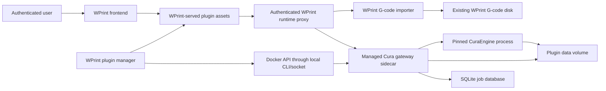
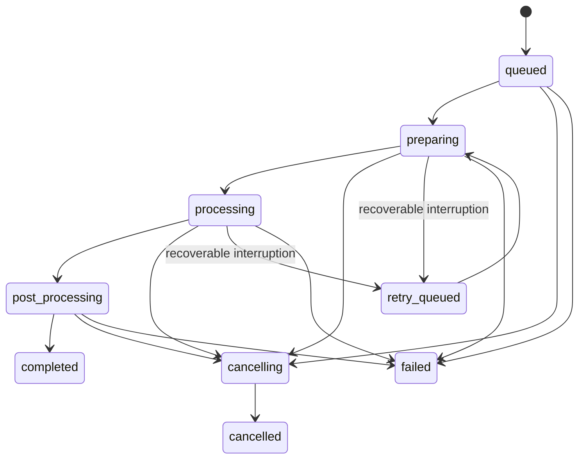

# Cura Integration Architecture and Contracts

**Status:** Required reference and decision gate.

**Purpose:** Freeze ownership, trust boundaries, lifecycle semantics, API shapes, storage layout, and versioning before implementation. A smaller model should treat this document as authoritative. If an implementation detail cannot satisfy this contract, stop and amend this document with the reason before changing code.

## 1. System architecture



### Request path

The embedded browser UI uses an authenticated same-origin base URL:

```text
/backend/api/plugins/cura-web-ui/runtime/api/v1
```

WPrint validates the user and plugin, resolves the installed sidecar from observed dependency state, attaches the sidecar bearer token, injects trusted host-context headers, and forwards the request over the internal Docker network.

The browser must never receive or derive:

- `http://cura-web-slicer:9311`;
- the internal container name;
- the Docker network name;
- the sidecar bearer token;
- a host filesystem or Docker-volume path.

### Background work ownership

The Cura sidecar owns its durable work queue. Do not dispatch one Laravel queue job per slice. Reasons:

- the `.w3dp` remains self-contained and can run on any compatible WPrint host;
- jobs survive gateway restarts through SQLite recovery;
- CuraEngine cancellation remains local to the process owner;
- plugin installation does not require Cura-specific Mongo models or queue code in the core;
- Redis remains an implementation detail of WPrint and is currently not durable enough to be the only slice-job record.

WPrint owns only the lifecycle of the service and the final import into the normal G-code library.

## 2. Trust boundaries

| Boundary | Trust rule |
| --- | --- |
| Browser to WPrint | Existing authenticated session and existing native API middleware are mandatory. |
| WPrint to sidecar | Random per-installation bearer token, stored encrypted and injected as an environment variable. |
| Sidecar to CuraEngine | Local subprocess only; no shell command construction from user strings. |
| Plugin manifest to Docker | Only normalized allowlisted fields become Docker flags. No raw Docker arguments or host paths. |
| Sidecar data to WPrint G-code disk | Stream through a dedicated importer with size, name, MIME, and path validation. |
| OCI registry to host | Official/built-in images must be referenced by immutable digest in a signed manifest. |
| `.w3dp` to host | Signature verification plus signed file-integrity metadata for packaged assets. |

## 3. SDK revision decision

Introduce WPrint Plugin SDK `1`, revision `5`.

Revision 5 adds:

- managed service storage;
- enforced service resource and security policy;
- runtime HTTP proxy declaration;
- workspace-fill custom-bundle presentation;
- runtime artifact import declaration;
- signed package file-integrity metadata;
- explicit stop grace period and pull timeout;
- built-in distribution metadata maintained by the host, not self-asserted by plugins.

Revisions 0–4 remain supported. Do not reinterpret their manifests with unsafe defaults that break existing plugins. Existing revision-2 managed images continue to run with conservative host defaults, but only revision 5 can request persistent service storage or browser runtime proxying.

## 4. Target plugin manifest

The generated Cura manifest must have this semantic shape. The final digest and version are release-generated values, not hardcoded placeholders in a published archive.

```json
{
  "id": "cura-web-ui",
  "name": "Cura Web UI Slicer",
  "version": "0.2.0",
  "sdkVersion": 1,
  "sdkRevision": 5,
  "minCoreVersion": "<first-core-version-with-sdk-r5>",
  "runtime": {
    "type": "bridge",
    "managedImageId": "slicer-runtime",
    "healthcheck": "/api/v1/health",
    "httpProxy": {
      "pathPrefix": "/api/v1",
      "methods": ["GET", "POST", "PUT", "DELETE"],
      "requestTimeoutSecs": 30,
      "streamTimeoutSecs": 900,
      "maxUploadMb": 256
    },
    "artifactImports": [
      {
        "id": "gcode",
        "pathPattern": "^/api/v1/jobs/[A-Za-z0-9_-]+/gcode$",
        "contentTypes": ["text/x-gcode", "text/plain"],
        "maxSizeMb": 512
      }
    ]
  },
  "requirements": {
    "memoryMb": 2048,
    "cpuCores": 2,
    "diskMb": 4096
  },
  "images": [
    {
      "id": "slicer-runtime",
      "image": "ghcr.io/wprint3d/cura-web-slicer:0.2.0@sha256:<digest>",
      "engine": "docker",
      "pullTimeoutSecs": 900,
      "healthcheck": {
        "command": ["python", "-m", "app.healthcheck"],
        "timeoutSecs": 10
      },
      "service": {
        "port": 9311,
        "networkAlias": "cura-web-slicer",
        "environment": {
          "SLICER_GATEWAY_HOST": "0.0.0.0",
          "SLICER_GATEWAY_PORT": "9311",
          "SLICER_GATEWAY_AUTH_MODE": "wprint-bridge",
          "SLICER_GATEWAY_STORAGE_ROOT": "/data",
          "SLICER_GATEWAY_MAX_CONCURRENT_JOBS": "1",
          "SLICER_CURAENGINE_AUTO_DOWNLOAD": "0"
        },
        "storage": {
          "mountPath": "/data",
          "retainOnUninstall": true
        },
        "resources": {
          "memoryMb": 2048,
          "cpuCores": 2,
          "pids": 256
        },
        "security": {
          "readOnlyRootFilesystem": true,
          "noNewPrivileges": true,
          "capDrop": ["ALL"],
          "tmpfs": [{"path": "/tmp", "sizeMb": 1024}],
          "user": "10001:10001"
        },
        "stopGracePeriodSecs": 30
      }
    }
  ],
  "permissions": [
    "storage.write",
    "ui.page",
    "ui.custom_bundle"
  ],
  "uiExtensions": [
    {
      "id": "cura-web-ui-page",
      "surface": "page",
      "mode": "custom_bundle",
      "presentation": "workspace",
      "title": "Slicer",
      "bundle": {"url": "asset://ui/index.html"}
    }
  ],
  "assets": [
    {"id": "ui", "path": "ui"},
    {"id": "licenses", "path": "licenses"},
    {"id": "metadata", "path": "metadata"}
  ],
  "integrity": {
    "algorithm": "sha256",
    "files": {
      "ui/index.html": "<sha256>",
      "metadata/build.json": "<sha256>"
    }
  },
  "signature": {"algorithm": "none"}
}
```

The packager replaces `signature` when signing. The source manifest may use a development image reference, but release packaging must fail if `<digest>`, `latest`, `localhost`, `127.0.0.1`, or an unsigned manifest remains.

## 5. Managed container desired state

The core computes a `runtimeSpecHash` from normalized fields that affect the container:

- image reference including digest;
- environment except generated secret values;
- port and network alias;
- storage volume identity and mount path;
- resource/security flags;
- args and stop grace period;
- current WPrint network identity.

Store this hash as both:

- `wprint3d.plugin.runtime_spec_hash=<hash>` Docker label;
- `dependency_state.runtime.specHash` in MongoDB.

Reconciliation rules:

| Observed state | Required action |
| --- | --- |
| Container missing, plugin enabled | Create, start, healthcheck, mark ready. |
| Container stopped, spec matches | Start, healthcheck, mark ready. |
| Container running, spec matches, health passes | Keep it; do not recreate. |
| Container spec differs | Blue/green replacement, healthcheck, remove old container after success. |
| Container health fails | Mark failed and retain diagnostics; do not crash WPrint. |
| Plugin disabled, container exists | Stop and remove container; preserve volume. |
| Plugin uninstalled, retain policy true | Remove container and retain named volume. |
| Plugin uninstalled, explicit delete-data confirmation | Remove container and named volume. |

Use deterministic names derived from sanitized plugin and image IDs, but never rely on the name alone to decide that a container is correct. Inspect labels and image digest.

## 6. Installation and update transaction

### New installation

```text
inspect and verify W3DP
→ validate manifest/core compatibility
→ verify signed asset hashes
→ pull every declared image with per-image timeout
→ run image-level health command if declared
→ extract package to a staging directory
→ create/update private volume
→ persist installed plugin as disabled
→ atomically promote staged package path
→ enable only if requested by install policy
```

If any step before persistence fails, delete staging files and leave no installed plugin record. Never delete a previously installed version during a failed update.

### Enabled update

```text
stage and verify new W3DP
→ pull new image by digest
→ retain previous package, manifest, state, and container
→ create candidate container with a temporary name/alias
→ healthcheck candidate directly
→ atomically switch canonical network alias/runtime state
→ persist new plugin version
→ remove previous container
```

If candidate health fails, remove only the candidate, restore the previous dependency state, keep the previous version enabled, and record an update failure. The public plugin remains ready on its previous version.

## 7. Runtime authentication and host context

Generate a 32-byte random token on first managed-runtime activation. Encrypt it with Laravel's application encryption before storing it. Never place plaintext in plugin logs or serialized API responses.

Inject into the sidecar:

```text
WPRINT3D_BRIDGE_TOKEN=<plaintext only in container environment>
WPRINT3D_PLUGIN_ID=cura-web-ui
```

Every proxied request includes:

```text
Authorization: Bearer <runtime token>
X-WPrint-Plugin-Id: cura-web-ui
X-WPrint-User-Id: <authenticated user id>
X-WPrint-Printer-Id: <active or explicitly supplied printer id, if valid>
X-WPrint-Locale: <effective locale>
X-Request-Id: <WPrint request id>
```

Strip any browser-supplied versions of these headers before injection.

The sidecar's `wprint-bridge` auth mode accepts the bearer token and uses `X-WPrint-User-Id` as the job owner. Standalone `local-token` mode continues to use `local-user`.

## 8. Browser host context

WPrint extends the embedded asset URL with non-secret context:

| Query parameter | Example | Meaning |
| --- | --- | --- |
| `hostMode` | `wprint3d` | Select embedded behavior. |
| `pluginId` | `cura-web-ui` | Installed plugin identity. |
| `extensionId` | `cura-web-ui-page` | Active UI extension. |
| `pluginRuntimeBase` | `/backend/api/plugins/cura-web-ui/runtime` | Same-origin gateway base. |
| `pluginArtifactImportBase` | `/backend/api/plugins/cura-web-ui/runtime-artifacts` | Same-origin import endpoint. |
| `currentPrinterId` | opaque ID | Current WPrint printer, if any. |
| `locale` | `es-AR` | Effective locale. |
| `fallbackLocale` | `en` | Fallback locale. |
| `theme` | JSON semantic tokens | Existing WPrint token bridge. |
| `realtimeTransport` | `polling` | Embedded event transport. |

Do not include a gateway token or internal URL. The standalone UI still uses `VITE_SLICER_GATEWAY_URL` and `VITE_SLICER_GATEWAY_TOKEN` when `hostMode` is absent.

## 9. Gateway storage contract

The sidecar receives one mounted volume at `/data` with this layout:

```text
/data/
├── db/
│   └── slicer.sqlite3
├── uploads/
│   └── <upload-id>/
│       ├── source.bin
│       └── metadata.json
├── jobs/
│   └── <job-id>/
│       ├── request.json
│       ├── engine/
│       ├── output.gcode
│       ├── engine.log
│       ├── thumbnail.svg
│       └── layers/
│           ├── index.json
│           └── <layer-id>.json.zst
└── cleanup/
    └── .lock
```

All IDs are server-generated opaque identifiers. API input never supplies a filesystem path. Resolve paths by ID under known roots and reject symlinks or traversal.

## 10. Upload and job API contract

Add the following API while preserving existing standalone capabilities.

### Create upload

```http
POST /api/v1/uploads
Content-Type: multipart/form-data

file=<binary>
```

Response `201`:

```json
{
  "id": "upload_abcd1234",
  "fileName": "part.stl",
  "mimeType": "model/stl",
  "sizeBytes": 12345,
  "sha256": "...",
  "createdAt": "..."
}
```

### Create job

`SliceModelInput` gains `uploadId`. Release mode rejects `dataBase64`; development compatibility may accept it behind an explicit setting and materialize it as an upload before job creation.

```json
{
  "apiVersion": "1.1",
  "mode": "server",
  "models": [
    {
      "id": "model-1",
      "uploadId": "upload_abcd1234",
      "fileName": "part.stl",
      "mimeType": "model/stl",
      "transform": {
        "position": [0, 0, 0],
        "rotation": [0, 0, 0],
        "scale": [1, 1, 1]
      },
      "role": "print"
    }
  ]
}
```

### Job state

Use these states and transitions:



Every job response includes:

- `ownerId` only for internal persistence, not public cross-user listing;
- `status`;
- `stage`;
- `progress` from 0 through 100;
- `attempt` and `maxAttempts`;
- timestamps;
- immutable request/profile snapshot;
- engine version and adapter version;
- artifacts after they exist;
- structured error after terminal failure.

Idempotency: `POST /jobs` accepts `Idempotency-Key`. Repeating the same key for the same owner returns the original job. Reusing it with a different payload returns `409`.

## 11. Polling contract

Embedded mode uses polling because the Laravel runtime proxy does not proxy WebSockets in phase one.

- Poll an active job every 750 ms for the first 10 seconds.
- Then poll every 1500 ms while active.
- Stop on `completed`, `failed`, or `cancelled`.
- Back off to 3 seconds after three consecutive network errors.
- Resume immediately when the browser becomes visible.
- Do not create duplicate polling loops when React Strict Mode remounts effects.

Standalone mode may continue to use the existing WebSocket endpoint. The client transport selects WebSocket only when a websocket factory is present and `realtimeTransport` is `websocket`.

## 12. G-code import contract

The browser calls:

```http
POST /backend/api/plugins/cura-web-ui/runtime-artifacts/gcode
Content-Type: application/json

{
  "runtimePath": "/api/v1/jobs/job_abcd1234/gcode",
  "fileName": "part.gcode",
  "subDirectory": "Sliced"
}
```

WPrint must:

1. authorize the user;
2. require plugin `storage.write`;
3. verify the runtime path against the signed manifest's `artifactImports` pattern;
4. stream from the resolved sidecar with the bridge token;
5. enforce the declared byte limit while streaming;
6. reject redirects and non-allowed content types;
7. sanitize directory and filename using existing file-library rules;
8. write to a temporary file on the `gcode` disk;
9. fail on collision unless the user explicitly chose a new name;
10. atomically move the temporary file into place;
11. return the same normalized file metadata expected by the WPrint file list;
12. delete the temporary file on every failure path.

Do not make the browser download and re-upload the G-code.

## 13. Cleanup and retention

Default policy:

- incomplete upload with no job: delete after 24 hours;
- failed/cancelled job engine temporaries: delete after 24 hours;
- completed job source and artifacts: retain 7 days;
- SQLite job metadata: retain 30 days;
- imported WPrint G-code: governed by existing WPrint file deletion, not sidecar cleanup;
- plugin volume on disable: retain;
- plugin volume on update: retain;
- plugin volume on uninstall: retain by default and offer explicit delete-data action to an administrator.

Cleanup must enforce a configurable total volume budget. Delete eligible oldest artifacts first. Never delete files belonging to an active job.

## 14. Compatibility matrix

Record and enforce these independent versions:

| Version | Source | Compatibility use |
| --- | --- | --- |
| WPrint core version | WPrint build | `minCoreVersion` gate. |
| Plugin SDK revision | `plugin.json` | Manifest/host feature gate. |
| Cura Web UI version | package version | Browser/gateway release identity. |
| Gateway API version | OpenAPI | Browser/runtime protocol. |
| Runtime image digest | signed manifest | Exact executable runtime. |
| CuraEngine version/commit | image labels and build metadata | Reproducibility and support. |
| Cura resource revision | image labels/build metadata | Definition/profile compatibility. |

The browser build and gateway image in a `.w3dp` release must share the same Cura Web UI version. The gateway health/capabilities response exposes it, and the embedded UI shows a blocking incompatibility screen if the major/minor contract is unsupported.

## 15. Architecture acceptance checklist

Before starting `02-wprint-managed-runtime-hardening.md`, confirm:

- [ ] Product agrees that the sidecar, not Laravel/Redis, owns durable slice jobs.
- [ ] Product agrees that normal `.w3dp` files reference OCI images instead of embedding them.
- [ ] Offline OCI embedding is explicitly deferred.
- [ ] SDK revision 5 is accepted.
- [ ] Same-origin HTTP proxy plus polling is accepted for the first embedded release.
- [ ] Plugin-private Docker volume retention policy is accepted.
- [ ] G-code import goes server-to-server and does not round-trip through the browser.
- [ ] One concurrent CuraEngine job is accepted as the initial default.
- [ ] `amd64` and `arm64` are both release gates.
- [ ] The page is a WPrint workspace surface; redundant standalone chrome is removed in embedded mode.
