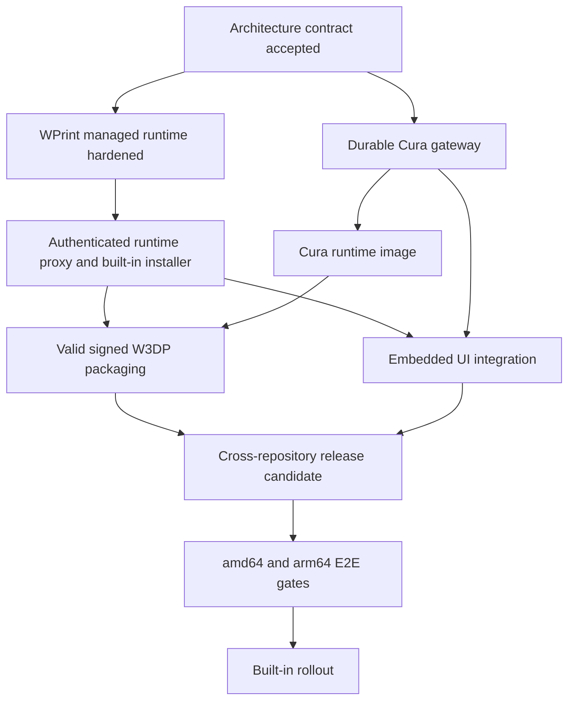

# Cura Web UI Integration Plan Set

**Audience:** This plan is intentionally explicit enough for a smaller implementation model. Follow it in order. Do not collapse phases, rename contracts, or substitute a different architecture without recording the decision in `01-architecture-and-contracts.md` first.

**Goal:** Ship Cura Web UI as a signed, built-in WPrint 3D plugin whose `.w3dp` contains the browser UI and the complete declaration needed for WPrint 3D to pull, secure, start, update, stop, and diagnose a CuraEngine-backed Docker sidecar.

**Repositories:**

- `wprint3d-core`: this repository.
- `cura-web-ui`: sibling repository at `../cura-web-ui`.

All permanent documentation, code comments, manifest copy, release notes, and commit messages must be written in English. User-interface localization files may contain localized strings.

## Non-negotiable decisions

1. The feature is distributed as a `.w3dp`, even when WPrint 3D bundles it as a built-in plugin.
2. The `.w3dp` contains `plugin.json`, the compiled browser UI, notices, and build metadata. It references a separately published OCI image by immutable digest; it does not normally embed OCI layers.
3. `cura-web-ui` owns the sidecar source, image definition, browser source, gateway API, durable slicing job state, and `.w3dp` source tree.
4. WPrint 3D owns authentication, plugin trust, Docker lifecycle, runtime isolation, same-origin browser proxying, built-in installation, and import of completed G-code into the WPrint file library.
5. CuraEngine remains behind a process/HTTP boundary. Do not import CuraEngine internals into Laravel or the WPrint frontend.
6. The browser never receives the sidecar bearer token and never connects to the Docker network alias directly.
7. Slicing jobs are durable inside the sidecar's host-managed plugin volume. Redis and Laravel queues are not the source of truth for slicing jobs.
8. The first production concurrency is one CuraEngine process per WPrint installation. Higher concurrency is a later, measured configuration.
9. WPrint startup must remain usable if the optional slicer runtime fails. The plugin is marked failed with an actionable error; printers and existing print flows continue working.
10. Installation, update, and rollback must never leave an enabled plugin pointing at a stale container image.
11. Runtime auto-download of CuraEngine is disabled in release images. The image is built from pinned and verified inputs.
12. Release readiness requires real slicing on both `linux/amd64` and `linux/arm64`. A development-only architecture exception must be explicit and must not masquerade as supported.

## Final ownership model

| Concern | Owner | Persistent location |
| --- | --- | --- |
| WPrint user/session authorization | WPrint core | Existing WPrint auth/session stores |
| Plugin manifest and installed version | WPrint core | MongoDB plus extracted `.w3dp` runtime path |
| Managed container desired/observed state | WPrint core | Plugin `dependency_state` in MongoDB |
| Runtime bearer secret | WPrint core | Encrypted plugin dependency state |
| Uploaded mesh bytes | Cura sidecar | Host-managed plugin Docker volume |
| Slice job records and attempts | Cura sidecar | SQLite in the plugin volume |
| CuraEngine temporary work | Cura sidecar | Plugin volume job directory and bounded `/tmp` |
| Generated G-code before import | Cura sidecar | Plugin volume artifact directory |
| Imported printable G-code | WPrint core | Existing `gcode` filesystem disk |
| Browser UI assets | `.w3dp`, served by WPrint | Extracted plugin package directory |

## Plan order and gates

Execute the documents in this exact order:

1. [`01-architecture-and-contracts.md`](01-architecture-and-contracts.md) — reference contract; no implementation until its checklist is accepted.
2. [`02-wprint-managed-runtime-hardening.md`](02-wprint-managed-runtime-hardening.md) — SDK revision, Docker isolation, transactional replacement, reconciliation, and tests.
3. [`03-wprint-runtime-proxy-and-builtins.md`](03-wprint-runtime-proxy-and-builtins.md) — same-origin proxy, G-code import, and built-in `.w3dp` installation.
4. [`04-cura-durable-gateway.md`](04-cura-durable-gateway.md) — upload/artifact API, SQLite job store, worker lifecycle, cancellation, recovery, cleanup, and API contracts.
5. [`05-cura-container-and-package.md`](05-cura-container-and-package.md) — multi-architecture runtime image, valid WPrint manifest, UI asset packaging, signing inputs, and licenses.
6. [`06-embedded-ui-integration.md`](06-embedded-ui-integration.md) — WPrint host context, embedded transport, visual integration, responsive behavior, and completed-file handoff.
7. [`07-release-verification-and-rollout.md`](07-release-verification-and-rollout.md) — cross-repository release sequence, compatibility matrix, end-to-end verification, observability, rollback, and rollout.
8. [`08-implementation-tracker.md`](08-implementation-tracker.md) — compact task ledger and evidence template; use it throughout all phases.

Do not begin a later plan while a required gate from an earlier plan is red. It is acceptable to develop independent code behind a feature flag, but it must not be enabled in the built-in plugin until all prior gates pass.

## Dependency graph

## Required working discipline

For every task:

1. Read the task completely before editing.
2. Inspect the named files again; plans describe the baseline observed on 2026-08-06, but nearby code can change.
3. Preserve unrelated dirty-worktree changes. At plan creation time, `wprint3d-core` already had unrelated modified and untracked files.
4. Write the focused failing test first when the task defines one.
5. Make the smallest implementation that satisfies the contract.
6. Run the focused command listed in the task.
7. Run the phase gate before moving to the next document.
8. Update the applicable architecture and SDK documentation in the same change as behavior.
9. Do not claim Docker, browser, or architecture support that was not exercised.

## Baseline findings that the implementation must not forget

The current WPrint core already supports the basic heavyweight-plugin path:

- `plugin.json -> images[]` is validated.
- `runtime.managedImageId` selects a service image.
- install/update executes `docker pull`.
- enable executes `docker run`, attaches the current Compose network, resolves a bridge URL, and runs a healthcheck.
- disable/uninstall removes managed service containers.
- the production and development backend containers include Docker CLI and mount `/var/run/docker.sock`.

The following gaps are real and are addressed by this plan set:

- an updated image does not reliably replace an already-running container;
- enabled plugins are not fully reconciled during application bootstrap;
- manifests cannot request a host-managed persistent volume without arbitrary host paths;
- CPU/memory declarations are advisory and not applied to `docker run`;
- read-only root, capability dropping, PID limits, tmpfs, non-root users, and secret injection are missing;
- the install path is not fully transactional;
- image pulls use a short global command timeout;
- the current Cura manifest is invalid for the WPrint validator and uses a static bridge URL;
- the Cura gateway uses FastAPI `BackgroundTasks`, memory/JSON storage, base64 model payloads, and in-memory events;
- the Cura repository has no production runtime Dockerfile and does not package `apps/web/dist` into the plugin;
- the embedded app ignores WPrint host context and points at `127.0.0.1:9311` by default;
- a full-page custom bundle is currently rendered inside a generic card with a fixed minimum height.

## Global definition of done

The integration is complete only when all of the following are true:

- A fresh WPrint install discovers the bundled, signed Cura `.w3dp` without a source checkout.
- WPrint verifies the `.w3dp`, pulls an image pinned by digest, creates private plugin storage, and starts the sidecar with enforced limits.
- The Cura page opens from WPrint in light and dark themes and at the required responsive breakpoints.
- The browser uses a same-origin WPrint URL; it has no Docker alias or sidecar token.
- A user can upload a real STL/3MF-supported input, create a durable job, observe progress, cancel it, recover after a sidecar restart, preview real layers, and import completed G-code into WPrint's file list.
- Disabling the plugin stops its sidecar without deleting durable data.
- Re-enabling restarts it and preserves completed jobs.
- Updating to a new `.w3dp` replaces the container image, healthchecks it, and rolls back automatically on failure.
- Removing the plugin follows an explicit retain-or-delete-data policy.
- `linux/amd64` and `linux/arm64` release images each complete a real CuraEngine cube slice.
- WPrint remains operational when the slicer image cannot be pulled or the healthcheck fails.
- All focused tests, full repository tests, image tests, package validation, and visual verification gates pass.
