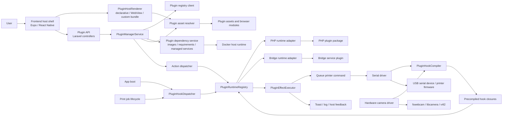
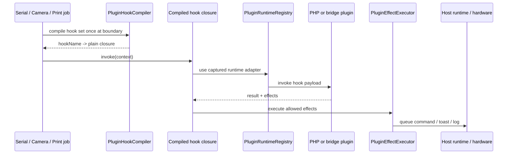
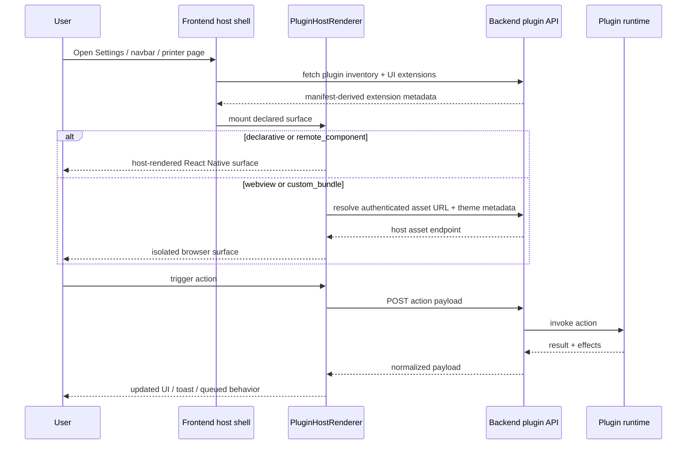

# Plugin SDK Reference

## SDK Identity

Current SDK pair:

- `sdkVersion: 1`
- `sdkRevision: 5`

`sdkVersion` is the API level.

`sdkRevision` is the contract revision within that API level. Revisions let WPrint 3D evolve the SDK without immediately forcing a full API-level jump.

## Platform Communication Model

WPrint 3D keeps the host in control of plugin discovery, execution, UI mounting, and hardware access. Plugins do not talk to serial devices, cameras, USB discovery, or host UI primitives directly. They communicate through host-owned APIs, actions, hooks, effects, and declared UI surfaces.

### System Diagram



### Hook Execution Flow



### Frontend Flow



### Hardware Boundaries

- Printer communication stays inside the host serial driver.
- Camera capture stays inside host camera tooling.
- USB discovery stays inside the host mapper/runtime environment.
- Plugins can observe and influence host behavior only through approved hooks, actions, and effects.
- Bridge plugins can live outside the default host process, but they still receive host-shaped payloads rather than raw hardware access.

## Manifest Fields

### Required

- `id`
- `name`
- `version`
- `sdkVersion`
- `runtime`

### Recommended

- `sdkRevision`
- `description`
- `author`
- `homepageUrl`
- `documentationUrl`
- `sourceUrl`
- `minCoreVersion`
- `icon`
- `permissions`
- `actions`
- `uiExtensions`
- `signature`
- `assets`
- `components`
- `updateSource`
- `requirements`
- `images`
- `i18n`

### Plugin Translation Files

Plugins may declare optional host-managed translation files:

```json
"i18n": {
  "defaultLocale": "en",
  "files": {
    "es": "asset://translations/es.json",
    "es_AR": "asset://translations/es.json"
  }
}
```

Rules:

- `i18n.defaultLocale` is optional and defaults to the host fallback locale.
- `i18n.files` keys are locale tags such as `es`, `fr`, or `es_AR`.
- Each file reference must point at a declared manifest asset.
- Files must be JSON objects.

Supported translation sections:

- `plugin`
- `actions`
- `uiExtensions`
- `components`

Browser-based plugin UIs also receive:

- `locale`
- `fallbackLocale`

as query parameters on the embedded asset URL.

### Signature Schema

Unsigned manifests use:

```json
"signature": {
  "algorithm": "none"
}
```

Signed release packages use:

```json
"signature": {
  "algorithm": "openssl-sha256",
  "keyId": "sha1-of-embedded-public-key",
  "publicKey": "-----BEGIN PUBLIC KEY-----\n...\n-----END PUBLIC KEY-----\n",
  "publicKeySha256": "sha256-of-embedded-public-key",
  "value": "base64-signature"
}
```

Notes:

- `plugin:pack --signing-key=...` signs the canonical manifest payload with SHA-256.
- The embedded `publicKey` is there for transparency and offline verification.
- Host trust still depends on configured or synced trusted keys, not on blindly trusting the package’s embedded key.

### Canonical Plugin URLs

Public plugins should declare these manifest fields so registry entries and landing pages do not guess URLs from the monorepo:

- `homepageUrl`: the canonical repository or project homepage
- `documentationUrl`: the primary install or usage docs page
- `sourceUrl`: the canonical source repository

All three must be absolute `http` or `https` URLs when present.

## Runtime Contracts

### PHP Runtime

Manifest:

```json
"runtime": {
  "type": "php",
  "entry": "plugin.php"
}
```

Actions and hooks point at relative PHP files such as:

- `actions/ping.php`
- `hooks/on_boot.php`

The host invokes them with JSON on `STDIN`.

Available environment variables:

- `WPRINT3D_PLUGIN_ID`
- `WPRINT3D_PLUGIN_STORAGE_PATH`
- `WPRINT3D_BASE_PATH`
- `WPRINT3D_VENDOR_AUTOLOAD`

### Bridge Runtime

Manifest:

```json
"runtime": {
  "type": "bridge",
  "baseUrl": "http://bridge-service:9310",
  "healthcheck": "/health"
}
```

Or, for a host-managed bridge service:

```json
"runtime": {
  "type": "bridge",
  "managedImageId": "metrics-service",
  "healthcheck": "/health"
}
```

Revision 5 managed bridges may declare host-mediated authentication and a same-origin proxy:

```json
"runtime": {
  "type": "bridge",
  "managedImageId": "cura-gateway",
  "healthcheck": "/api/v1/health",
  "auth": { "mode": "wprint-bridge" },
  "proxy": { "enabled": true, "allowedPaths": ["/api/v1"] }
}
```

The host creates and encrypts the bridge token, injects it only into the managed container, and forwards trusted user context through the proxy. The browser receives only same-origin host URLs; it never receives the container URL or token.

The host performs:

- `GET /health` when enabling the plugin
- `POST` to hook/action paths for runtime work
- starts the managed service container automatically when `managedImageId` is declared

Action payload:

```json
{
  "kind": "action",
  "action": "host_metrics",
  "payload": {},
  "context": {
    "userId": "...",
    "printerId": null
  }
}
```

Hook payload:

```json
{
  "kind": "hook",
  "hook": "app.boot",
  "context": {}
}
```

### Heavyweight Dependencies

Manifest:

```json
"requirements": {
  "memoryMb": 1024,
  "cpuCores": 2
},
"images": [
  {
    "id": "metrics-service",
    "image": "ghcr.io/acme/metrics-service:1.2.3@sha256:<64-hex-digest>",
    "engine": "auto",
    "healthcheck": {
      "command": ["curl", "-f", "http://127.0.0.1:9310/health"],
      "timeoutSecs": 15
    },
    "service": {
      "port": 9310,
      "networkAlias": "acme-metrics",
      "storage": [{ "name": "data", "target": "/data" }],
      "resources": { "memoryMb": 2048, "cpuQuota": 100000, "pidsLimit": 256 },
      "security": { "readOnlyRootFs": true, "noNewPrivileges": true, "capDrop": ["ALL"], "user": "10001:10001", "tmpfs": [{ "path": "/tmp", "sizeMb": 1024 }] },
      "stopGracePeriodSecs": 30
    }
  }
]
```

Rules:

- No `images` means the plugin is `lightweight`.
- Any declared image makes the plugin `heavyweight`.
- Install/update pulls declared images automatically.
- `healthcheck.command` is optional.
- `requirements.memoryMb`, `requirements.cpuCores`, and `requirements.diskMb` are advisory host checks that surface warnings in the UI when the current system is below the plugin's declared minimum target; disk is checked when free-space metrics are available.
- Revision 5 service storage is restricted to private named volumes mounted below `/data`; host paths, Docker sockets, USB devices, and arbitrary bind mounts are not accepted.
- Storage may use the compact `{mountPath, retainOnUninstall}` form or the expanded mount array; WPrint normalizes both forms, permits at most one writable mount, and preserves the retention flag in runtime state.
- Revision 5 image references must be immutable OCI references ending in `@sha256:<64-hex>`. Mutable tags such as `:latest` are not accepted for managed dependencies.
- Revision 5 managed services cannot select a Docker network. WPrint resolves the configured/current plugin-capable network; manifests may declare only the service port and network alias and cannot request host/none/foreign networks.
- Revision 5 service resource/security settings are enforced by the host Docker runner. Runtime changes are identified by a spec fingerprint and cause safe container recreation.
- Host limits reject, rather than silently clamp, pull timeouts, memory, CPU quota, PID count, tmpfs size, and capability drops outside the configured allowlists. `cpuCores`/`pids` are accepted aliases and normalize to the host runner's `cpuQuota`/`pidsLimit` fields.
- `service.stopGracePeriodSecs` controls the bounded Docker stop timeout during replacement; `security.user` accepts a numeric `uid[:gid]` and is enforced with `docker run --user`.
- `security.tmpfs` may declare `/tmp` or `/run`; its size is bounded by the host `plugins.container.max_tmpfs_mb` limit (4,096 MB by default). A read-only service without a declaration receives the safe 256 MB fallback.
- Image healthchecks execute with an explicit `--entrypoint` override, `--network none`, a read-only root, and a bounded temporary filesystem so an image entrypoint cannot reinterpret the check command.
- `runtime.managedImageId` can point at an image with `service.port` so WPrint 3D can run a self-contained bridge sidecar.
- Revision-5 manifests may use `runtime.httpProxy` as the declarative form of the host proxy; WPrint normalizes its path prefix/methods into the internal proxy policy, bounds request/stream timeouts, and enforces the declared multipart ceiling. WebSocket upgrades are rejected in favor of polling. `runtime.artifactImports` declares anchored server-to-server artifact patterns and host-bounded content types/sizes.
- Runtime proxy routes use separate host rate-limit buckets for metadata/polling, uploads/job creation, and artifact imports; throttled responses retain Laravel's `429`/`Retry-After` contract.
- Signed revision-5 W3DP packages include `integrity: { algorithm: "sha256", files: { ... } }`; the map must cover exactly every staged asset file and cannot contain paths outside declared assets.

## OctoPrint Compatibility Layer

The current SDK revision adds the compatibility primitives needed to port most OctoPrint plugins with an AI agent instead of a full manual rewrite.

### Mixin Mapping

| OctoPrint concept | WPrint 3D equivalent |
| --- | --- |
| `SettingsPlugin.get_settings_defaults()` | `plugin.json -> settings.defaults` |
| `on_settings_save()` | `PUT /api/plugins/{id}/settings` plus runtime action reads |
| `TemplatePlugin` navbar/settings templates | `uiExtensions` with `surface: "navbar_widget"` and `surface: "settings_tab"` |
| `AssetPlugin` static files | manifest `assets` resolved through `asset://...` |
| `_plugin_manager.send_plugin_message(...)` | effect `send_plugin_message` or `publish_state` |
| `SimpleApiPlugin` AJAX calls | action endpoints under `/api/plugins/{id}/actions/{actionId}` |
| Knockout view models reading plugin state | `/api/plugins/{id}/state` or `octoprint-compat.js` `watchState()` |

### Settings And State Endpoints

Authenticated plugin surfaces can now rely on:

- `GET /api/plugins/{pluginId}/settings`
- `PUT /api/plugins/{pluginId}/settings`
- `GET /api/plugins/{pluginId}/state`
- `GET /api/plugins/{pluginId}/logs`

Settings are seeded from `plugin.json -> settings.defaults` and persisted per installed plugin record. State is updated by runtime effects such as `send_plugin_message`.

When a plugin exposes a `settings_tab`, WPrint 3D wraps the surface in a host-owned settings shell. That shell now defaults to a collapsed plugin-details hero so the plugin's actual settings UI stays visible immediately; users can expand the header to inspect metadata, trust badges, and warnings on demand.

### Graceful Load Failure Model

Plugin startup is no longer treated as all-or-nothing process termination for the host.

Installed plugins now expose a load state:

- `disabled`
- `ready`
- `failed`

When startup or development-source synchronization fails, WPrint 3D:

- keeps the host running
- marks the plugin as `failed`
- stores `lastError`
- records lifecycle log entries
- keeps the failure visible to the frontend through the installed-plugin payload

That is the preferred pattern for future runtime additions too: record failure state on the plugin record instead of letting plugin-specific exceptions masquerade as host crashes.

### Browser Helper For Ported Plugins

`GET /api/plugins/sdk/octoprint-compat.js` exposes `window.WPrint3DOctoPrintCompat`.

It provides:

- `fromWindow()` to build a host bridge from query-string metadata injected by WPrint 3D
- `getSettings()`
- `saveSettings(settings)`
- `getState()`
- `invokeAction(actionId, payload)`
- `watchState(callback, options)`
- `getTheme()`

This is the preferred bridge for ported OctoPrint settings pages that previously depended on Knockout models or direct AJAX helpers.

### Native Navbar Ports

OctoPrint navbar plugins should prefer a host-rendered `data_strip` widget instead of recreating the entire navbar inside a WebView. On `surface: "navbar_widget"`, the host renders `data_strip` as an inline telemetry lane that expands across the center navbar slot so ports like NavbarTemp feel native to the shell instead of looking like detached chip stacks.

Navbar widgets may set `mobilePresentation` on the UI extension. Use `card` to move normal text-and-icon items into a wrapped surface below the mobile app bar, or `gauges` to keep numeric items inside the app bar as icon-only micro gauges. Omit the field to keep the standard inline presentation at every breakpoint.

Example UI extension:

```json
{
  "id": "navbartemp-navbar",
  "surface": "navbar_widget",
  "mode": "declarative",
  "title": "NavbarTemp",
  "mobilePresentation": "gauges",
  "schema": {
    "component": "data_strip",
    "dataActionId": "snapshot",
    "pollIntervalMs": 10000,
    "itemsPath": "items",
    "gap": 4
  }
}
```

Gauge items keep the normal desktop `text` field and add `label`, `displayValue`, `value`, `targetValue`, `min`, and `max`. The numeric range controls the mobile ring. Tapping a micro gauge shows its compact actual/target values for five seconds, then fades back to the icon-only presentation. A null `targetValue` displays only the current value.

Example declarative schema:

```json
{
  "component": "data_strip",
  "dataActionId": "snapshot",
  "pollIntervalMs": 10000,
  "itemsPath": "items",
  "gap": 4
}
```

The action should return:

```json
{
  "data": {
    "items": [
      {
        "id": "tool-0",
        "icon": "printer-3d-nozzle",
        "text": "Tool: 205.0°C"
      }
    ]
  },
  "effects": [
    {
      "type": "send_plugin_message",
      "merge": false,
      "data": {
        "items": [
          {
            "id": "tool-0",
            "text": "Tool: 205.0°C"
          }
        ]
      }
    }
  ]
}
```

That gives you:

- native theme parity in the WPrint 3D navbar
- browser settings pages that can still preview the same state
- a single action result that updates both the host-rendered widget and the browser-side settings panel

### PHP Runtime Bootstrap For Ports

If a port needs access to Laravel models, configuration, or host services, the PHP runtime now exposes:

- `WPRINT3D_BOOTSTRAP_APP`

Typical pattern:

```php
$bootstrapPath = getenv('WPRINT3D_BOOTSTRAP_APP');

if ($bootstrapPath && is_file($bootstrapPath)) {
    $app = require $bootstrapPath;
    $app->make(\Illuminate\Contracts\Console\Kernel::class)->bootstrap();
}
```

That is how the `OctoPrint NavbarTemp Port` reads the active printer state and SBC temperature from host-owned services without bypassing the plugin runtime contract.

## Supported Permissions

- `printer.read`
- `printer.command.queue`
- `camera.read`
- `host.metrics.read`
- `network.outbound`
- `storage.read`
- `storage.write`
- `ui.settings_tab`
- `ui.navbar_widget`
- `ui.printer_panel`
- `ui.printer_action`
- `ui.modal`
- `ui.page`
- `ui.webview`
- `ui.custom_bundle`

## Supported Hooks

- `app.boot`
- `serial.command.before_send`
- `serial.command.response_received`
- `serial.line.received`
- `camera.snapshot.before_take`
- `camera.snapshot.after_take`
- `print.job.started`
- `print.job.failed`
- `print.job.finished`

Hot serial and camera hooks are compiled once into plain closures and reused inside their loops. One-shot lifecycle hooks such as `app.boot` still use the regular dispatcher path because they are not performance-sensitive.

## Supported Surfaces

- `settings_tab`
- `navbar_widget`
- `printer_panel`
- `printer_action`
- `modal`
- `page`

## UI Modes

### Declarative

Required field:

- `schema`

Supported host-rendered components:

- `host.section`
- `host.card`
- `host.surface`
- `host.stack`
- `host.column`
- `host.row`
- `host.scroll`
- `host.text`
- `host.heading`
- `host.caption`
- `host.divider`
- `host.list`
- `host.key_value`
- `host.button`
- `host.input`
- `host.switch`
- `host.form`
- `host.chip_group`
- `host.badge`
- `host.progress`
- `host.progress_cluster`
- `host.data_strip`
- `host.spacer`
- `host.remote_component`

Legacy short names such as `section`, `text`, `button`, `progress_cluster`, and `remote_component` remain supported for backward compatibility, but new plugins should prefer the `host.*` ids.

`host.progress_cluster` fields:

- `dataActionId`
- `pollIntervalMs`
- `items[]`

Each item supports:

- `id`
- `label`
- `valueKey`

### Host Component Registry

The declarative host path is now a stable component registry rather than a handful of ad hoc renderer cases.

Rules:

- Prefer `host.*` component ids in new manifests.
- Treat the documented fields as the supported API surface.
- Do not assume every underlying React Native Paper prop is exposed to plugins.
- Use `webview` or `custom_bundle` when the host registry is not sufficient.

The current registry covers the common host-safe primitives plugin authors need across web and native:

- layout: `host.stack`, `host.row`, `host.surface`, `host.scroll`, `host.spacer`
- typography: `host.text`, `host.heading`, `host.caption`
- actions and forms: `host.button`, `host.input`, `host.switch`, `host.form`
- display: `host.section`, `host.card`, `host.list`, `host.key_value`, `host.badge`, `host.chip_group`, `host.progress`
- dynamic widgets: `host.progress_cluster`, `host.data_strip`, `host.remote_component`

Example:

```json
{
  "component": "host.stack",
  "gap": 10,
  "children": [
    {
      "component": "host.heading",
      "variant": "titleMedium",
      "text": "Host component registry"
    },
    {
      "component": "host.caption",
      "text": "This UI is rendered by the host on web and native."
    },
    {
      "component": "host.chip_group",
      "items": [
        {
          "text": "settings_tab",
          "icon": "cog-outline"
        },
        {
          "text": "declarative",
          "icon": "view-dashboard-outline"
        }
      ]
    },
    {
      "component": "host.button",
      "label": "Run action",
      "actionId": "ping"
    }
  ]
}
```

### WebView

Required field:

- `url`

Use `asset://ui/settings.html` for plugin-packaged assets.

### Custom Bundle

Required field:

- `bundle.url`

Use `asset://ui/settings.html` for plugin-packaged assets unless you intentionally host the bundle elsewhere.

## Manifest Components

The top-level `components` field declares reusable plugin components.

Example:

```json
"components": [
  {
    "id": "hostMetricsCard",
    "kind": "browser_module",
    "entry": "asset://components/host-metrics-card.js",
    "exports": "mount"
  }
]
```

Supported today:

- `kind: "remote_component"` for host-rendered declarative UI on web and native
- `kind: "browser_module"`
- `browser_module` use from `webview` and `custom_bundle` surfaces

Not supported today:

- arbitrary host-rendered React components inside declarative schema nodes

UI extensions may reference declared component IDs:

```json
"uiExtensions": [
  {
    "id": "host-metrics-settings",
    "surface": "settings_tab",
    "mode": "custom_bundle",
    "title": "Host Metrics",
    "bundle": {
      "url": "asset://ui/settings.html"
    },
    "components": ["hostMetricsCard"]
  }
]
```

Declarative schemas may mount a declared remote component directly:

```json
{
  "component": "host.remote_component",
  "componentId": "hostMetricsPanel",
  "props": {
    "title": "Host telemetry",
    "description": "This is rendered by the host."
  }
}
```

## Asset Rules

- Every plugin-packaged elevated UI entrypoint must be declared in `assets`.
- Every manifest component module must also be declared in `assets`.
- Asset paths must stay inside the plugin runtime directory.
- `..` segments are rejected.
- Asset-backed UI references are rewritten into authenticated host URLs at runtime.

Example:

```json
"assets": [
  {
    "path": "ui/settings.html"
  }
]
```

## Management API

### Inventory And Metadata

- `GET /api/plugins`
- `GET /api/plugins/{pluginId}`
- `GET /api/plugins/sdk`
- `GET /api/plugins/ui?surface=settings_tab`

### Install / Remove / Update

- `POST /api/plugins/install`
- `POST /api/plugins/{pluginId}/enable`
- `POST /api/plugins/{pluginId}/disable`
- `POST /api/plugins/{pluginId}/update`
- `DELETE /api/plugins/{pluginId}`

### Runtime

- `POST /api/plugins/{pluginId}/actions/{actionId}`
- `GET /api/plugins/{pluginId}/assets/{assetPath}`

Action calls are always host-mediated:

1. frontend or host code requests an action
2. the backend resolves the installed manifest
3. the runtime adapter invokes the plugin
4. the host executes any permitted returned effects
5. the caller receives normalized result data

### Registry

- `GET /api/plugins/registry`
- `GET /api/plugins/registry/sources`
- `PUT /api/plugins/registry/sources`

### Development

- `GET /api/plugins/development`
- `POST /api/plugins/install` with `unpackedPath`

## CLI

- From the host checkout, prefer `./plugin.sh <command>` so the plugin Artisan commands run inside the backend container.
- `php artisan plugin:make`
- `php artisan plugin:pack`
- `php artisan plugin:verify`
- `php artisan plugin:restore`
- `php artisan plugin:publish`
- `php artisan plugin:install`
- `php artisan plugin:search`
- `php artisan plugin:list`
- `php artisan plugin:enable`
- `php artisan plugin:disable`
- `php artisan plugin:remove`
- `php artisan plugin:update`
- `php artisan plugin:doctor`

Built-in packages are host-owned release artifacts. The production image reads
`resources/plugins/builtin/index.json`; it verifies the archive path, SHA-256,
manifest identity/version, and trusted signature before installing. Release
staging uses `scripts/stage-builtin-plugin.sh` with an immutable signed `.w3dp`.
An empty inventory is valid for development images and does not contact the
Marketplace.

`plugin:make` is now interactive and can scaffold any runtime/UI shape plus optional heavyweight image metadata. Use `--shape`, `--image`, `--memory`, and `--cpu` when you want a fully non-interactive generator.
`plugin:pack <plugin-path>` writes to `<plugin-path>/builds/<plugin-dir>.w3dp` by default. Use `--output` only when you need a custom location.
`plugin:verify <package.w3dp>` checks the embedded signer metadata and can fail closed with `--require-trusted`.
`plugin:restore <package.w3dp>` expands a package back into a source tree, which is useful for forks, incident response, and restoring packages that disappeared from the registry.

Signing helpers from the repo root:

- `./plugin.sh keygen`
- `./plugin.sh pack <plugin-path> --wizard`
- `./plugin.sh verify <package.w3dp>`
- `./plugin.sh verify <package.w3dp> --require-trusted`
- `./plugin.sh restore <package.w3dp> --output plugins/<fork-name>`
- `python3 scripts/plugin_sign.py <plugin-path> --private-key=/path/to/key.pem`
- `python3 scripts/plugin_verify_signature.py inspect <package.w3dp>`
- `python3 scripts/plugin_verify_signature.py verify <package.w3dp>`

## Host Theme Metadata For Elevated UI

Elevated UI entrypoints receive query parameters for:

- `pluginId`
- `pluginName`
- `extensionId`
- `extensionMode`
- `pluginApiBase`
- `actionId`
- `components`
- `componentIds`
- `theme`

The `theme` value is JSON and includes the current Paper theme color tokens such as:

- `primary`
- `secondary`
- `tertiary`
- `surface`
- `surfaceVariant`
- `background`
- `onSurface`
- `onSurfaceVariant`
- `outline`
- `outlineVariant`
- `error`

Elevated browser surfaces also receive the plugin API base URL and declared component metadata so they can call host actions and load manifest-declared browser modules without bypassing host control.

## Example Use Cases

- `php + declarative`: compact settings panels, navbar widgets, quick actions
- `php + webview`: lightweight HTML dashboards that still use host actions
- `php + custom_bundle`: heavier UI with richer client logic but local PHP runtime
- manifest-declared browser components: asset-backed JS modules mounted by elevated UI shells
- `bridge + declarative`: external integrations rendered in host-owned cards
- `bridge + webview`: full external-service integrations with isolated HTML UI
- `bridge + custom_bundle`: richest integration path when both runtime and UI live outside the default host path
