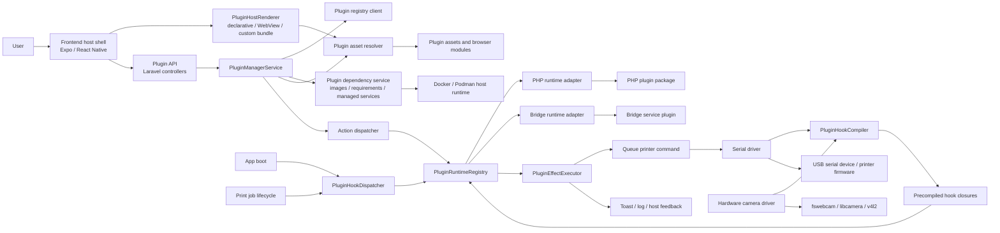
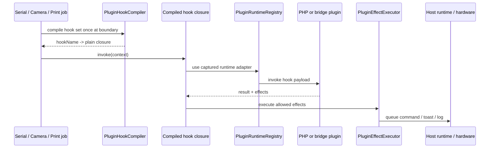
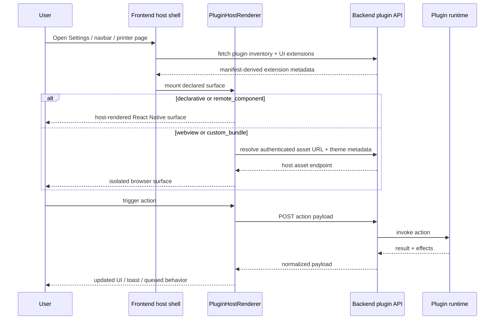

# Plugin SDK Reference

## SDK Identity

Current SDK pair:

- `sdkVersion: 1`
- `sdkRevision: 2`

`sdkVersion` is the API level.

`sdkRevision` is the contract revision within that API level. Revisions let WPrint 3D evolve the SDK without immediately forcing a full API-level jump.

## Platform Communication Model

WPrint 3D keeps the host in control of plugin discovery, execution, UI mounting, and hardware access. Plugins do not talk to serial devices, cameras, USB discovery, or host UI primitives directly. They communicate through host-owned APIs, actions, hooks, effects, and declared UI surfaces.

### System Diagram



### Hook Execution Flow



### Frontend Flow



### Hardware Boundaries

- Printer communication stays inside the host serial driver.
- Camera capture stays inside host camera tooling.
- USB discovery stays inside the host mapper/runtime environment.
- Plugins can observe and influence host behavior only through approved hooks, actions, and effects.
- Bridge plugins can live outside the default host process, but they still receive host-shaped payloads rather than raw hardware access.

## Manifest Fields

### Required

- `id`
- `name`
- `version`
- `sdkVersion`
- `runtime`

### Recommended

- `sdkRevision`
- `description`
- `author`
- `minCoreVersion`
- `icon`
- `permissions`
- `actions`
- `uiExtensions`
- `signature`
- `assets`
- `components`
- `updateSource`
- `requirements`
- `images`

## Runtime Contracts

### PHP Runtime

Manifest:

```json
"runtime": {
  "type": "php",
  "entry": "plugin.php"
}
```

Actions and hooks point at relative PHP files such as:

- `actions/ping.php`
- `hooks/on_boot.php`

The host invokes them with JSON on `STDIN`.

Available environment variables:

- `WPRINT3D_PLUGIN_ID`
- `WPRINT3D_PLUGIN_STORAGE_PATH`
- `WPRINT3D_BASE_PATH`
- `WPRINT3D_VENDOR_AUTOLOAD`

### Bridge Runtime

Manifest:

```json
"runtime": {
  "type": "bridge",
  "baseUrl": "http://bridge-service:9310",
  "healthcheck": "/health"
}
```

Or, for a host-managed bridge service:

```json
"runtime": {
  "type": "bridge",
  "managedImageId": "metrics-service",
  "healthcheck": "/health"
}
```

The host performs:

- `GET /health` when enabling the plugin
- `POST` to hook/action paths for runtime work
- starts the managed service container automatically when `managedImageId` is declared

Action payload:

```json
{
  "kind": "action",
  "action": "host_metrics",
  "payload": {},
  "context": {
    "userId": "...",
    "printerId": null
  }
}
```

Hook payload:

```json
{
  "kind": "hook",
  "hook": "app.boot",
  "context": {}
}
```

### Heavyweight Dependencies

Manifest:

```json
"requirements": {
  "memoryMb": 1024,
  "cpuCores": 2
},
"images": [
  {
    "id": "metrics-service",
    "image": "ghcr.io/acme/metrics-service:1.2.3",
    "engine": "auto",
    "healthcheck": {
      "command": ["curl", "-f", "http://127.0.0.1:9310/health"],
      "timeoutSecs": 15
    },
    "service": {
      "port": 9310,
      "networkAlias": "acme-metrics"
    }
  }
]
```

Rules:

- No `images` means the plugin is `lightweight`.
- Any declared image makes the plugin `heavyweight`.
- Install/update pulls declared images automatically.
- `healthcheck.command` is optional.
- `requirements.memoryMb` and `requirements.cpuCores` are advisory host checks that surface warnings in the UI when the current system is below the plugin's declared minimum target.
- `runtime.managedImageId` can point at an image with `service.port` so WPrint 3D can run a self-contained bridge sidecar.

## Supported Permissions

- `printer.read`
- `printer.command.queue`
- `camera.read`
- `host.metrics.read`
- `network.outbound`
- `storage.read`
- `storage.write`
- `ui.settings_tab`
- `ui.navbar_widget`
- `ui.printer_panel`
- `ui.printer_action`
- `ui.modal`
- `ui.page`
- `ui.webview`
- `ui.custom_bundle`

## Supported Hooks

- `app.boot`
- `serial.command.before_send`
- `serial.command.response_received`
- `serial.line.received`
- `camera.snapshot.before_take`
- `camera.snapshot.after_take`
- `print.job.started`
- `print.job.failed`
- `print.job.finished`

Hot serial and camera hooks are compiled once into plain closures and reused inside their loops. One-shot lifecycle hooks such as `app.boot` still use the regular dispatcher path because they are not performance-sensitive.

## Supported Surfaces

- `settings_tab`
- `navbar_widget`
- `printer_panel`
- `printer_action`
- `modal`
- `page`

## UI Modes

### Declarative

Required field:

- `schema`

Supported built-in components:

- `section`
- `text`
- `divider`
- `list`
- `key_value`
- `button`
- `form`
- `progress_cluster`
- `remote_component`

`progress_cluster` fields:

- `dataActionId`
- `pollIntervalMs`
- `items[]`

Each item supports:

- `id`
- `label`
- `valueKey`

### WebView

Required field:

- `url`

Use `asset://ui/settings.html` for plugin-packaged assets.

### Custom Bundle

Required field:

- `bundle.url`

Use `asset://ui/settings.html` for plugin-packaged assets unless you intentionally host the bundle elsewhere.

## Manifest Components

The top-level `components` field declares reusable plugin components.

Example:

```json
"components": [
  {
    "id": "hostMetricsCard",
    "kind": "browser_module",
    "entry": "asset://components/host-metrics-card.js",
    "exports": "mount"
  }
]
```

Supported today:

- `kind: "remote_component"` for host-rendered declarative UI on web and native
- `kind: "browser_module"`
- `browser_module` use from `webview` and `custom_bundle` surfaces

Not supported today:

- arbitrary host-rendered React components inside declarative schema nodes

UI extensions may reference declared component IDs:

```json
"uiExtensions": [
  {
    "id": "host-metrics-settings",
    "surface": "settings_tab",
    "mode": "custom_bundle",
    "title": "Host Metrics",
    "bundle": {
      "url": "asset://ui/settings.html"
    },
    "components": ["hostMetricsCard"]
  }
]
```

Declarative schemas may mount a declared remote component directly:

```json
{
  "component": "remote_component",
  "componentId": "hostMetricsPanel",
  "props": {
    "title": "Host telemetry",
    "description": "This is rendered by the host."
  }
}
```

## Asset Rules

- Every plugin-packaged elevated UI entrypoint must be declared in `assets`.
- Every manifest component module must also be declared in `assets`.
- Asset paths must stay inside the plugin runtime directory.
- `..` segments are rejected.
- Asset-backed UI references are rewritten into authenticated host URLs at runtime.

Example:

```json
"assets": [
  {
    "path": "ui/settings.html"
  }
]
```

## Management API

### Inventory And Metadata

- `GET /api/plugins`
- `GET /api/plugins/{pluginId}`
- `GET /api/plugins/sdk`
- `GET /api/plugins/ui?surface=settings_tab`

### Install / Remove / Update

- `POST /api/plugins/install`
- `POST /api/plugins/{pluginId}/enable`
- `POST /api/plugins/{pluginId}/disable`
- `POST /api/plugins/{pluginId}/update`
- `DELETE /api/plugins/{pluginId}`

### Runtime

- `POST /api/plugins/{pluginId}/actions/{actionId}`
- `GET /api/plugins/{pluginId}/assets/{assetPath}`

Action calls are always host-mediated:

1. frontend or host code requests an action
2. the backend resolves the installed manifest
3. the runtime adapter invokes the plugin
4. the host executes any permitted returned effects
5. the caller receives normalized result data

### Registry

- `GET /api/plugins/registry`
- `GET /api/plugins/registry/sources`
- `PUT /api/plugins/registry/sources`

### Development

- `GET /api/plugins/development`
- `POST /api/plugins/install` with `unpackedPath`

## CLI

- `php artisan plugin:make`
- `php artisan plugin:pack`
- `php artisan plugin:publish`
- `php artisan plugin:install`
- `php artisan plugin:search`

`plugin:make` is now interactive and can scaffold any runtime/UI shape plus optional heavyweight image metadata. Use `--shape`, `--image`, `--memory`, and `--cpu` when you want a fully non-interactive generator.
- `php artisan plugin:search`
- `php artisan plugin:install`
- `php artisan plugin:list`
- `php artisan plugin:enable`
- `php artisan plugin:disable`
- `php artisan plugin:remove`
- `php artisan plugin:update`
- `php artisan plugin:doctor`

## Host Theme Metadata For Elevated UI

Elevated UI entrypoints receive query parameters for:

- `pluginId`
- `pluginName`
- `extensionId`
- `extensionMode`
- `pluginApiBase`
- `actionId`
- `components`
- `componentIds`
- `theme`

The `theme` value is JSON and includes the current Paper theme color tokens such as:

- `primary`
- `secondary`
- `tertiary`
- `surface`
- `surfaceVariant`
- `background`
- `onSurface`
- `onSurfaceVariant`
- `outline`
- `outlineVariant`
- `error`

Elevated browser surfaces also receive the plugin API base URL and declared component metadata so they can call host actions and load manifest-declared browser modules without bypassing host control.

## Example Use Cases

- `php + declarative`: compact settings panels, navbar widgets, quick actions
- `php + webview`: lightweight HTML dashboards that still use host actions
- `php + custom_bundle`: heavier UI with richer client logic but local PHP runtime
- manifest-declared browser components: asset-backed JS modules mounted by elevated UI shells
- `bridge + declarative`: external integrations rendered in host-owned cards
- `bridge + webview`: full external-service integrations with isolated HTML UI
- `bridge + custom_bundle`: richest integration path when both runtime and UI live outside the default host path
