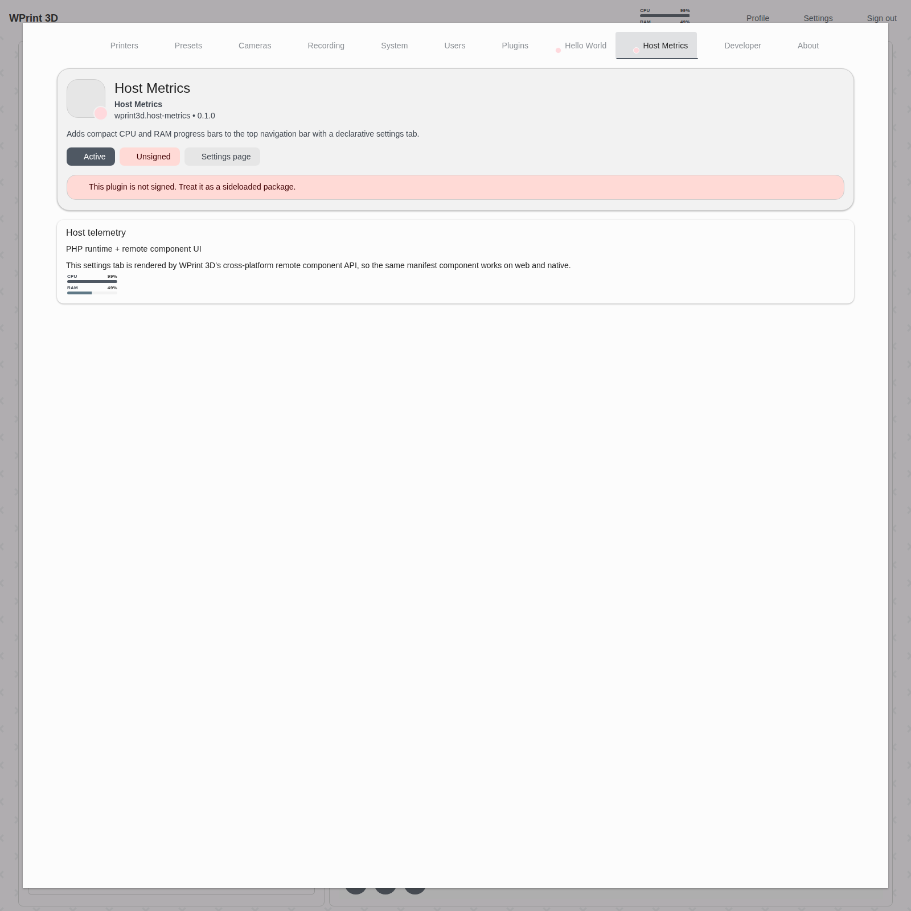
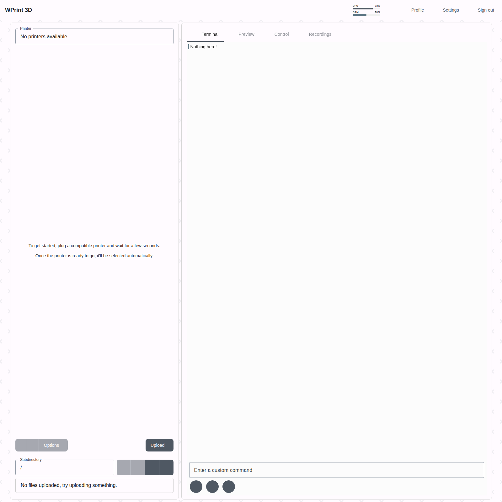
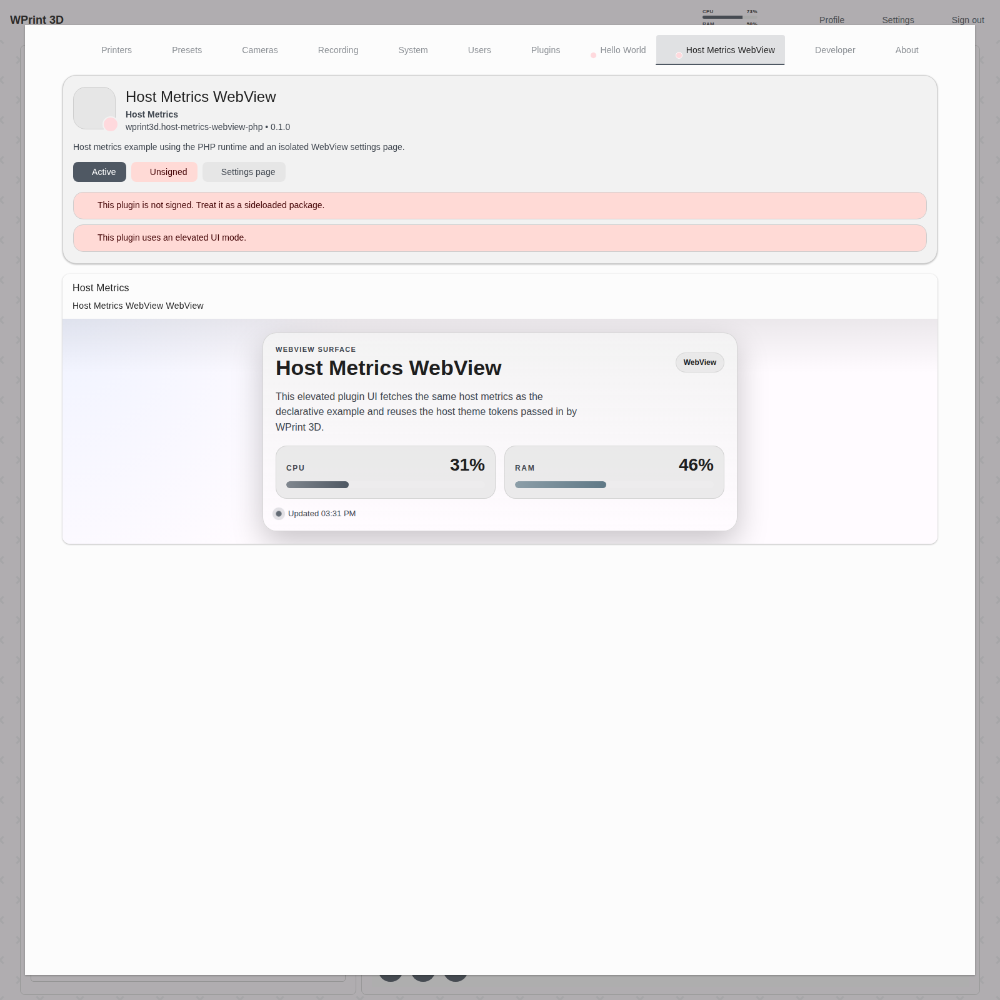
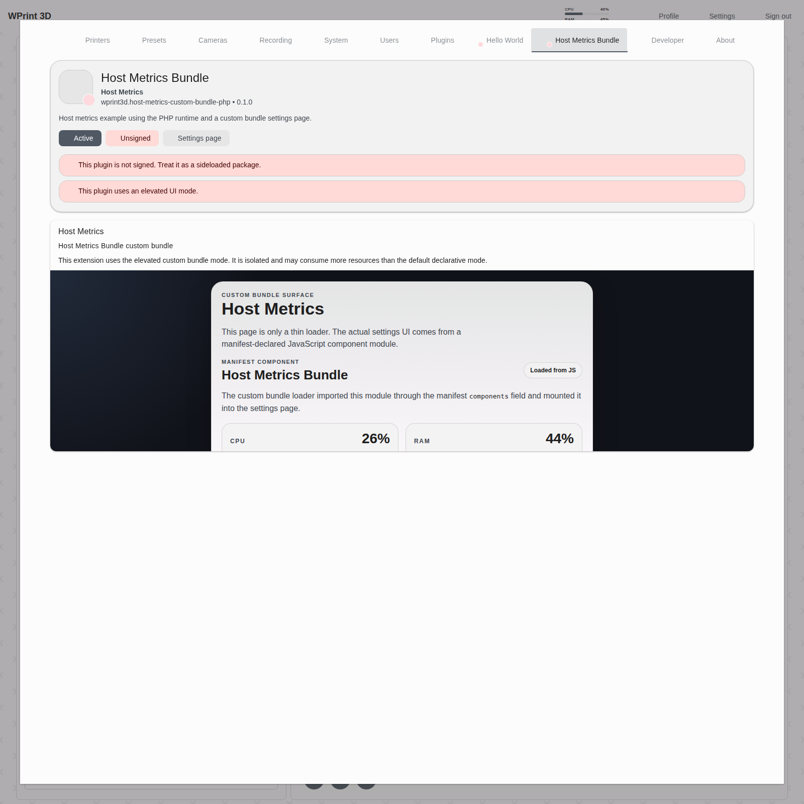
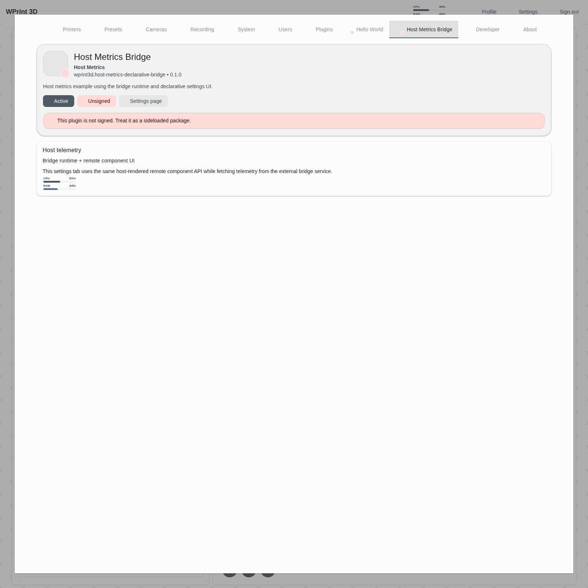
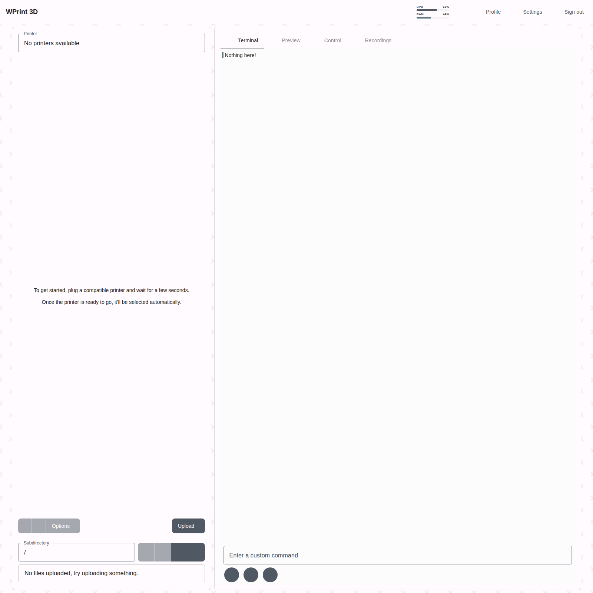
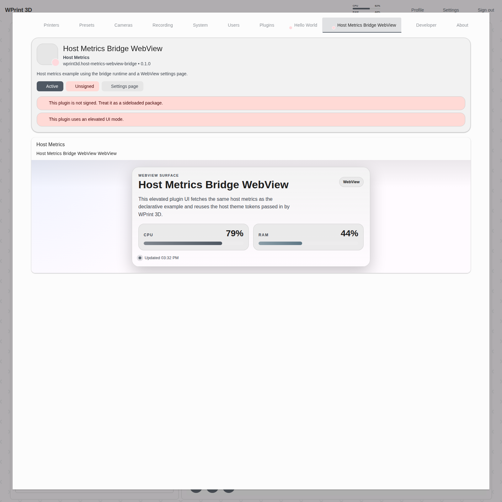
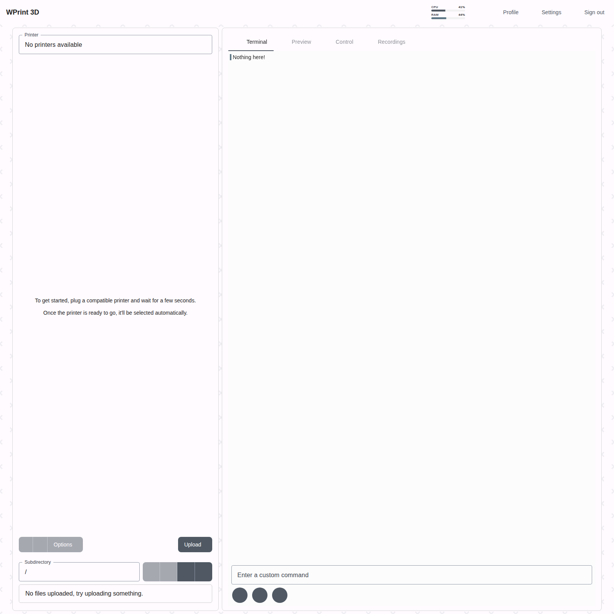

# Plugin Shape Matrix E2E

This walkthrough verifies the Host Metrics example across every supported runtime/UI shape combination.

Verified script:

- [scripts/e2e_plugin_shape_matrix.py](/home/facuarmo/wprint3d-core/scripts/e2e_plugin_shape_matrix.py)

Generated screenshots:

- [docs/assets/plugin-shapes](/home/facuarmo/wprint3d-core/docs/assets/plugin-shapes)

## What Was Verified

- all six Host Metrics shape variants package successfully
- each variant installs and enables cleanly
- each variant renders the same CPU/RAM navbar widget
- each variant exposes a dedicated plugin settings tab
- declarative, WebView, and custom-bundle settings surfaces all render in browser
- custom-bundle variants load a manifest-declared JS component module and render it in-browser
- declarative variants render a manifest-declared remote component through the host renderer
- compiled serial/camera hook invokers continue to power the same visible plugin behavior after the runtime refactor
- bridge variants work through the companion bridge service
- cleanup leaves the instance back at its previous plugin inventory

## Verified Commands

```bash
LOG_CHANNEL=stderr CACHE_DRIVER=array php artisan test \
  tests/Unit/Plugins/PluginHookCompilerTest.php \
  tests/Unit/Plugins/PluginManifestValidatorTest.php \
  tests/Feature/Plugins/PluginManagementApiTest.php \
  tests/Unit/Plugins/PluginArchiveServiceTest.php

docker exec wprint3d-core-backend-1 php artisan optimize:clear
docker exec wprint3d-core-web-1 sh -lc 'cd /app && pnpm exec expo export -p web'
python3 scripts/e2e_plugin_shape_matrix.py

# optional when your local proxy uses a non-default port
BASE_URL=https://127.0.0.1:8443 python3 scripts/e2e_plugin_shape_matrix.py
```

## Variant Matrix

### 1. PHP + Declarative

Example:

- [examples/plugins/host-metrics](/home/facuarmo/wprint3d-core/examples/plugins/host-metrics)

Navbar:


Settings:



### 2. PHP + WebView

Example:

- [examples/plugins/host-metrics-webview-php](/home/facuarmo/wprint3d-core/examples/plugins/host-metrics-webview-php)

Navbar:



Settings:



### 3. PHP + Custom Bundle

Example:

- [examples/plugins/host-metrics-custom-bundle-php](/home/facuarmo/wprint3d-core/examples/plugins/host-metrics-custom-bundle-php)

Navbar:


Settings:



### 4. Bridge + Declarative

Example:

- [examples/plugins/host-metrics-declarative-bridge](/home/facuarmo/wprint3d-core/examples/plugins/host-metrics-declarative-bridge)

Navbar:


Settings:



### 5. Bridge + WebView

Example:

- [examples/plugins/host-metrics-webview-bridge](/home/facuarmo/wprint3d-core/examples/plugins/host-metrics-webview-bridge)

Navbar:



Settings:



### 6. Bridge + Custom Bundle

Example:

- [examples/plugins/host-metrics-custom-bundle-bridge](/home/facuarmo/wprint3d-core/examples/plugins/host-metrics-custom-bundle-bridge)

Navbar:



Settings:


## Notes

- WebView and custom-bundle settings surfaces now render on Expo web through a host `iframe` path, while native platforms still use `react-native-webview`.
- The custom-bundle variants now verify the manifest `components` field by loading `components/host-metrics-card.js` from plugin assets and checking for the `Loaded from JS` marker in browser E2E.
- The declarative variants now verify the cross-platform remote component API through their `remote component UI` subtitles and remote-component-specific copy.
- Bridge variants rely on the helper service in [examples/plugins/host-metrics-bridge-service](/home/facuarmo/wprint3d-core/examples/plugins/host-metrics-bridge-service).
- The matrix installs each example one-by-one so the navbar stays readable and parity checks remain attributable to the active variant.
