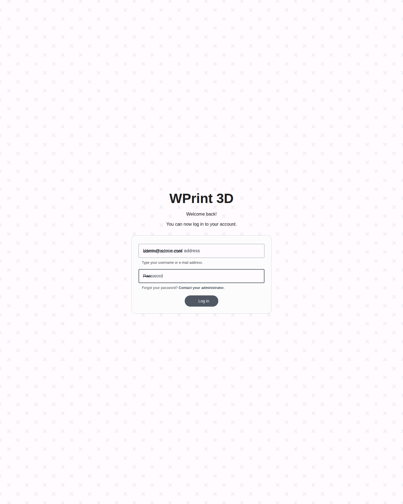
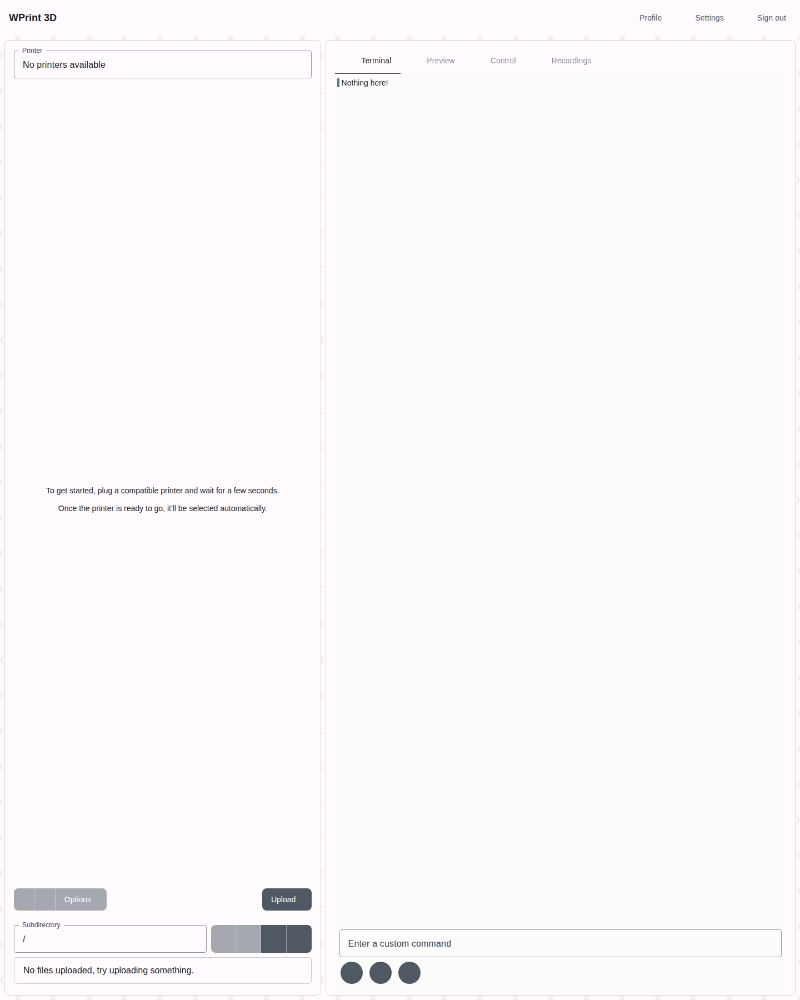
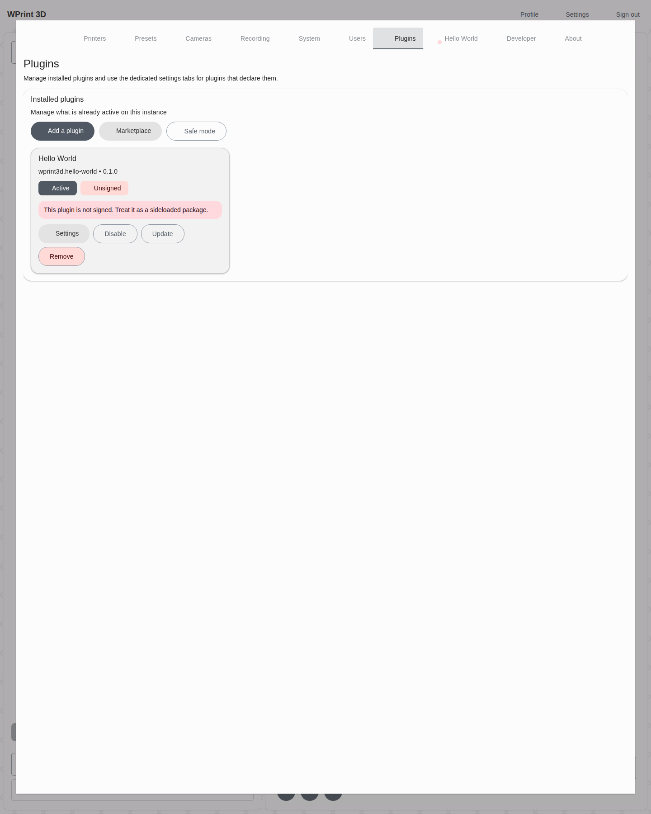
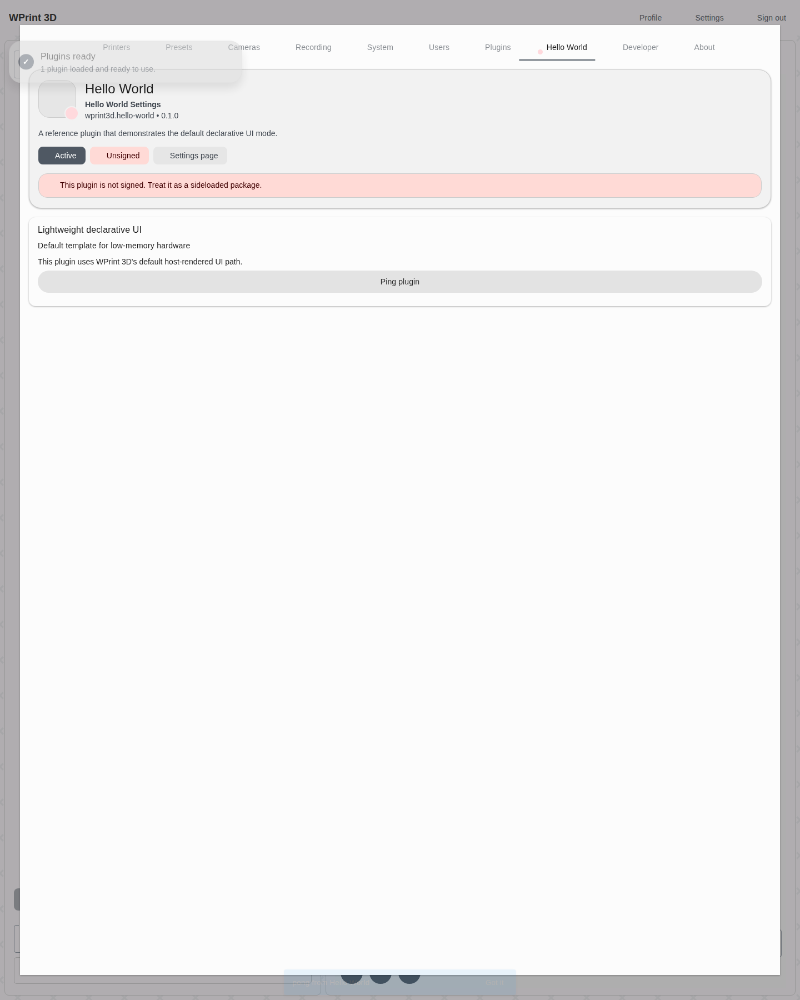
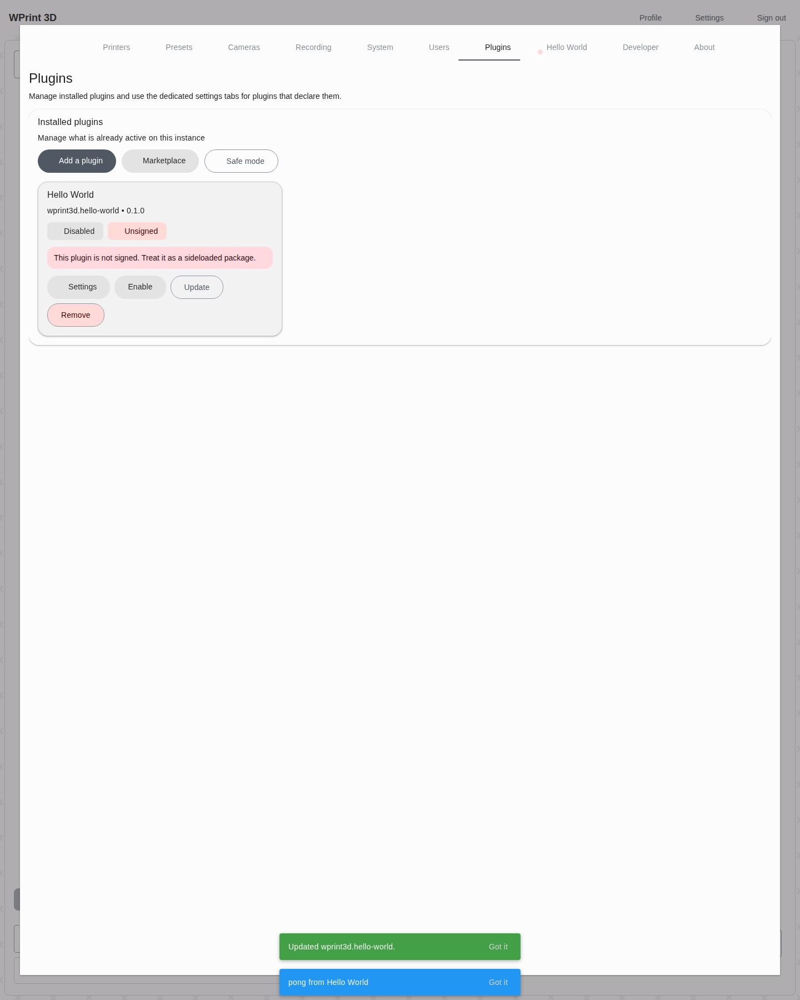
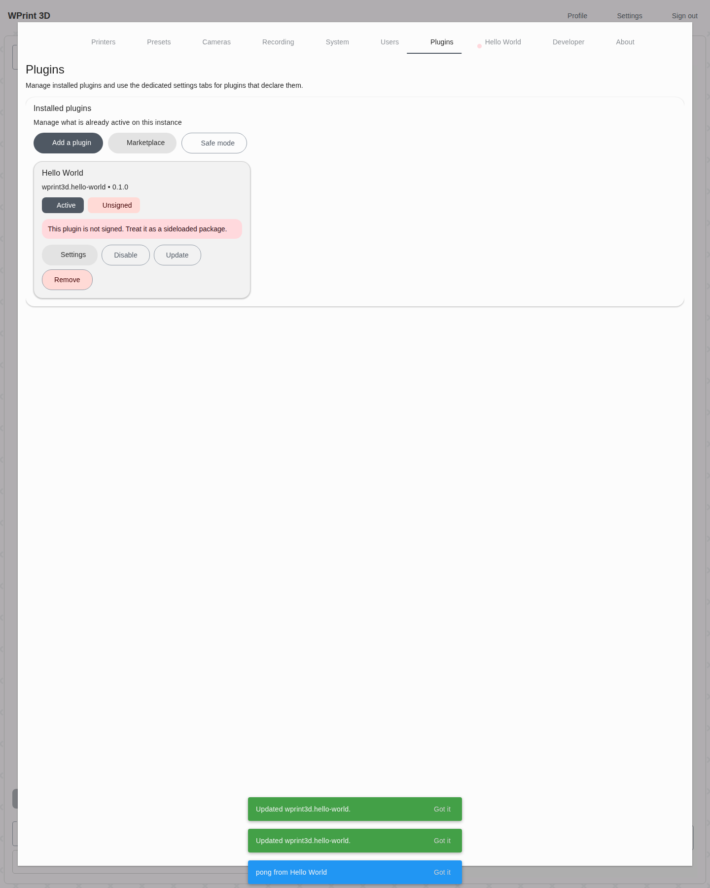

# Plugin Showcase And E2E Walkthrough

This document shows the current end-to-end plugin workflow in the local WPrint 3D stack, using the built-in sample plugin and the browser automation run captured on March 13, 2026.

## What Was Verified

- CLI scaffold generation with `plugin:make`
- CLI packaging with `plugin:pack`
- CLI install and enable with `plugin:install` and `plugin:enable`
- Browser login into the running WPrint 3D instance
- In-app plugin management from `Settings -> Plugins`
- Declarative plugin UI rendering inside the app
- Plugin action execution from the host-rendered UI
- Plugin disable and re-enable from the management UI
- Website marketplace shell at `wprint3d.github.io/app/plugins.tsx`

## Automation Artifacts

- Browser E2E script: [scripts/e2e_plugin_showcase.py](/home/facuarmo/wprint3d-core/scripts/e2e_plugin_showcase.py)
- Generated screenshots: [docs/assets/plugins](/home/facuarmo/wprint3d-core/docs/assets/plugins)

Re-run the browser capture with:

```bash
python3 scripts/e2e_plugin_showcase.py

# optional when your local proxy uses a non-default port
BASE_URL=https://127.0.0.1:8443 python3 scripts/e2e_plugin_showcase.py
```

## 1. Create A New Plugin Scaffold

Verified command:

```bash
CACHE_DRIVER=array LOG_CHANNEL=stderr php artisan plugin:make acme.showcase "Showcase Plugin" --path=/tmp/showcase-plugin
```

Observed generated files:

```text
/tmp/showcase-plugin/README.md
/tmp/showcase-plugin/actions/ping.php
/tmp/showcase-plugin/hooks/on_boot.php
/tmp/showcase-plugin/plugin.json
/tmp/showcase-plugin/plugin.php
```

The generated manifest defaults to:

- `php` runtime
- declarative `settings_tab` UI
- a lightweight `ping` action
- unsigned packaging by default

This matches the intended low-memory default for SBC-class hardware.

## 2. Package And Install A Plugin

The packaged and installed plugin in this run was the built-in example at [examples/plugins/hello-world](/home/facuarmo/wprint3d-core/examples/plugins/hello-world).

Verified commands inside the running backend container:

```bash
docker exec wprint3d-core-backend-1 php artisan plugin:pack /var/www/examples/plugins/hello-world --output /tmp/hello-world.w3dp
docker exec wprint3d-core-backend-1 php artisan plugin:install /tmp/hello-world.w3dp
docker exec wprint3d-core-backend-1 php artisan plugin:enable wprint3d.hello-world
docker exec wprint3d-core-backend-1 php artisan plugin:list
```

Verified installed state:

```text
+----------------------+-------------+---------+---------+----------+
| ID                   | Name        | Version | Enabled | Trust    |
+----------------------+-------------+---------+---------+----------+
| wprint3d.hello-world | Hello World | 0.1.0   | yes     | unsigned |
+----------------------+-------------+---------+---------+----------+
```

## 3. Log In To The Running App

The browser flow used the local stack already running on `https://127.0.0.1/`.

Test account used in this run:

- E-mail: `admin@admin.com`
- Password: `admin`

Login screen screenshot:



Dashboard after login:



## 4. Manage Plugins In The UI

From the top navigation, open `Settings`, then switch to the `Plugins` tab.

What was present during the run:

- add-plugin and marketplace entry points
- installed plugin card for `Hello World`
- trust warning for unsigned sideloaded plugins
- dedicated plugin settings tab reachable from the card's `Settings` button

Screenshot:



## 5. Execute A Plugin Action

The `Hello World` plugin exposes a declarative `Ping plugin` button inside its dedicated `Hello World Settings` tab. Clicking it triggered the backend action and produced the toast `pong from Hello World`.

Screenshot:



This validates the path:

1. declarative UI registration
2. dedicated plugin settings-tab routing
3. backend action dispatch
4. plugin PHP runtime execution
5. response surfaced back into the app

## 6. Disable And Re-Enable The Plugin

The same browser run toggled the plugin off and then back on from the Installed plugins card, including the confirmation prompts now shown for lifecycle changes.

Disabled state:



Enabled again:



This verifies that the management UI is mutating the plugin lifecycle correctly through the new plugin API surface.

## 7. Marketplace Page

The website route at `http://127.0.0.1:8082/plugins` rendered the plugin marketplace shell successfully.

Screenshot:


Note:

- During this run, the page shell loaded correctly.
- The remote registry index did not populate because the configured GitHub-backed index request returned errors in this environment.
- That means the listing shell is implemented and routable, but a healthy registry endpoint is still required for populated marketplace content.

## Current Gaps Observed During E2E

- The official registry section in both the app and website depends on a reachable index URL. In this environment, that request failed, so registry browsing was only partially validated.
- The local app uses a self-signed or untrusted certificate in this stack, so browser automation needed HTTPS certificate bypass.
- The plugin upload flow was not exercised through drag-and-drop because the current UI uses Expo `DocumentPicker` plus a web drop target, and the installed sample plugin was simpler to validate through the CLI install path.

## Recommended Next Checks

- Point `PLUGIN_REGISTRY_INDEX_URL` to a working registry and repeat the browser flow for registry install/update.
- Add a browser E2E case for `.w3dp` upload once a stable web file-input path is exposed.
- The full runtime/UI shape matrix now lives in [docs/plugin-shape-matrix-e2e.md](/home/facuarmo/wprint3d-core/docs/plugin-shape-matrix-e2e.md).
