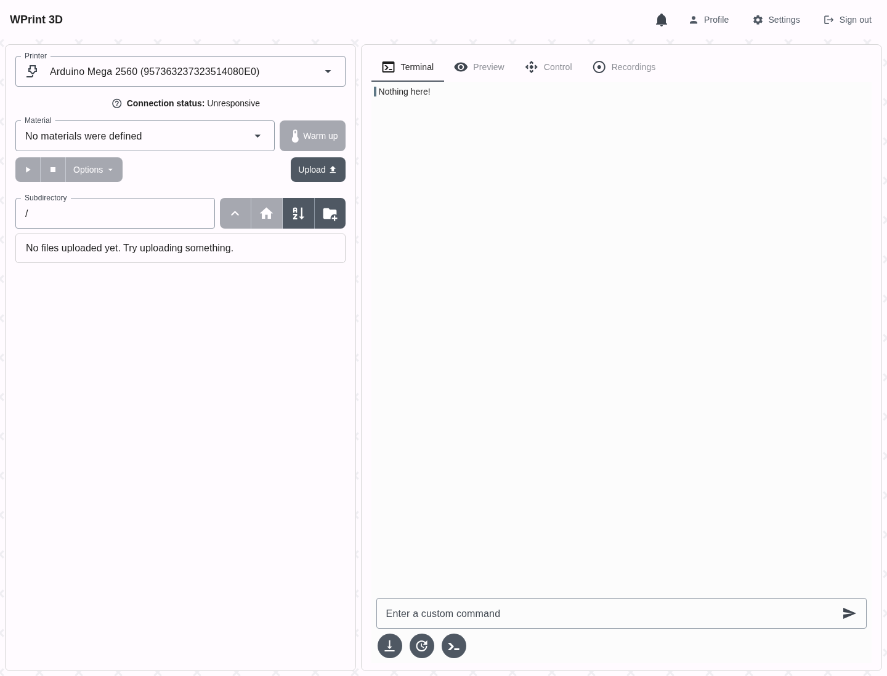
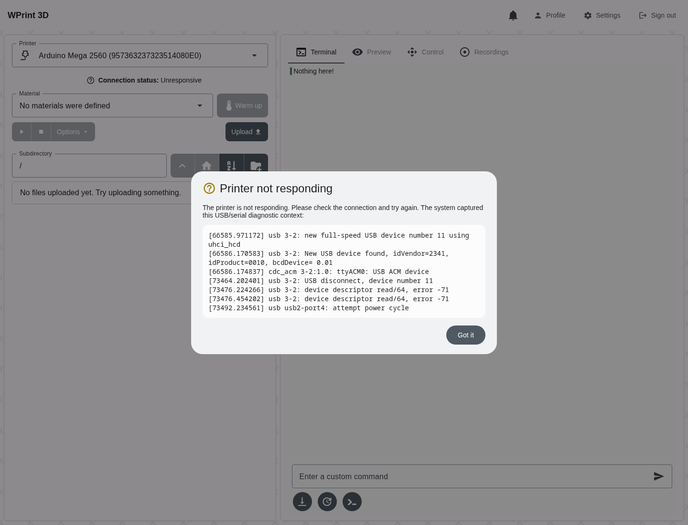
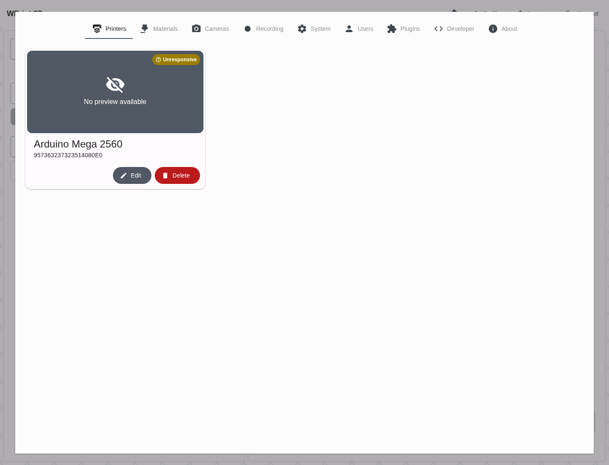
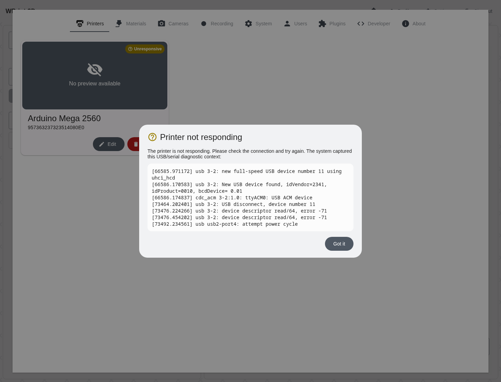
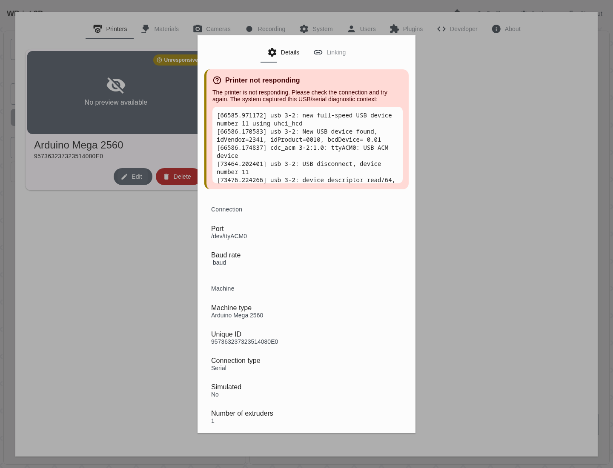

# Printer unresponsive status E2E

This page documents the real-app end-to-end check for the printer `unresponsive` connection status.

The screenshots below are captured from the actual Expo web app (`frontend/App.js` through `Main`, `UserLayout`, `UserPrinterStatusConnection`, and `NavBarMenuSettingsModalPrintersItem`). The E2E script simulates the backend responses that a dmesg-backed poller failure would produce:

```json
{
  "connectionStatus": "unresponsive",
  "connectionDiagnostic": "[73476.224266] usb 3-2: device descriptor read/64, error -71\n[73492.234561] usb usb2-port4: attempt power cycle"
}
```

Only the backend API inputs are mocked; the rendered UI is the real application.

## How to reproduce

Start the development stack or otherwise serve the frontend web app on `http://127.0.0.1:8081`:

```bash
./run.sh -e dev --no-build
```

Then run the real-app Playwright check:

```bash
python3 scripts/e2e_printer_unresponsive_status.py
```

The script saves screenshots into `docs/assets/printer-unresponsive-status/`.

## E2E evidence

The test asserts:

- the active printer page renders **unresponsive** from `/user/printer/selected/status`;
- the main status question-mark diagnostic modal includes the internal `dmesg` error snippet;
- the settings printer card badge renders **unresponsive**;
- clicking the settings badge opens a diagnostic modal with the same filtered kernel context;
- clicking **Edit** on the printer shows the detailed diagnostic box in the details tab.

### 1. Real app active printer status

The active printer panel displays **unresponsive** using the real application shell and status component.



### 2. Main status diagnostic modal

Clicking or tapping the status-bar question-mark in the real app opens the troubleshooting modal with `device descriptor read/64, error -71`.



### 3. Real app settings badge

The printer settings card renders the same **unresponsive** state in the real settings modal.



### 4. Settings badge diagnostic modal

Clicking or tapping anywhere on the settings badge opens the same diagnostic context, including the USB power-cycle clue.




### 5. Edit details diagnostic box

Clicking **Edit** on the unresponsive printer opens the details tab with a compact alert-like diagnostic box and the filtered dmesg context.


