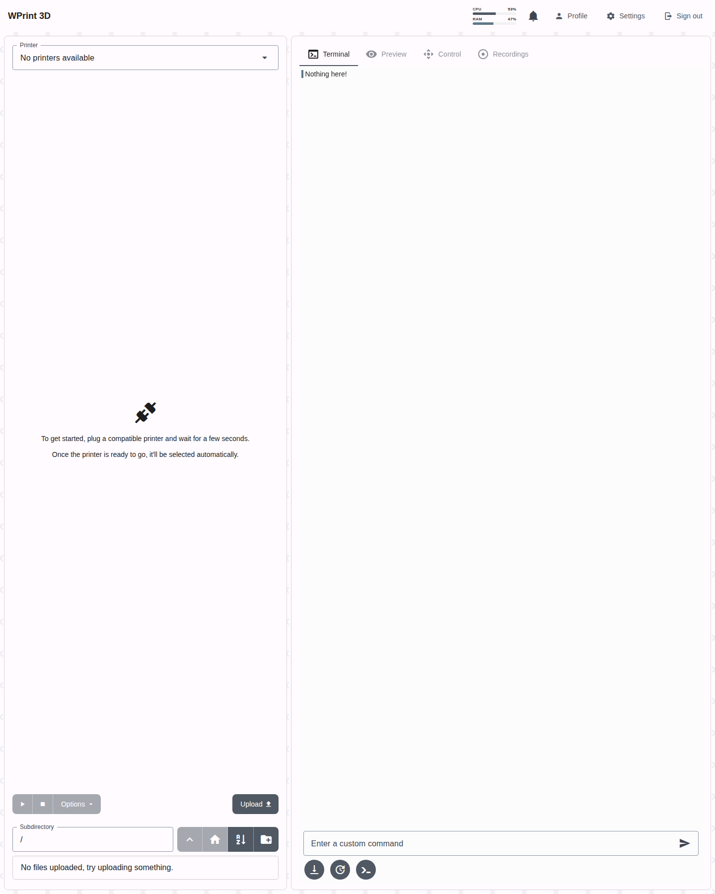
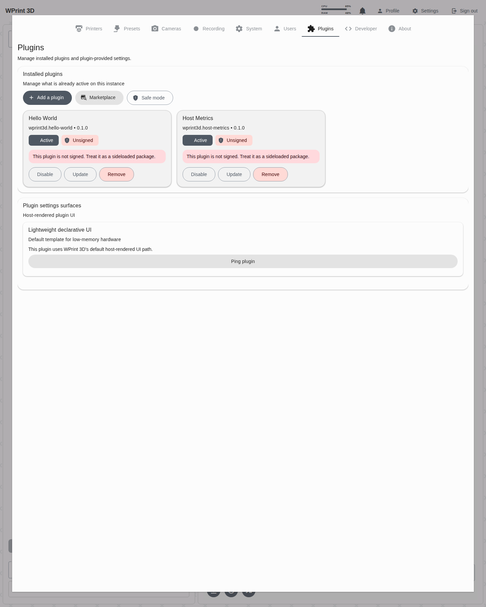
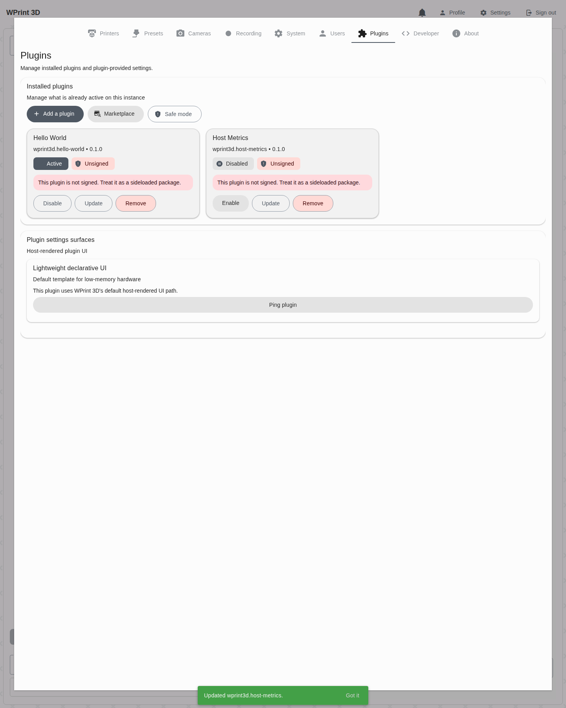
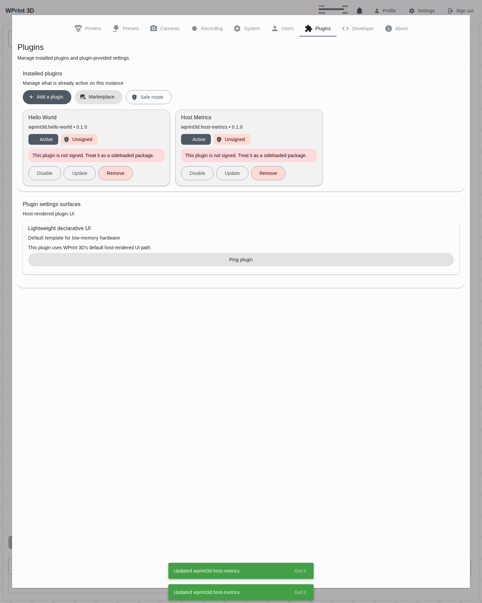

# Host Metrics Plugin Walkthrough

This document covers packaging, installation, browser verification, and day-to-day usage of the `wprint3d.host-metrics` example plugin.

The plugin adds two compact progress bars to the top navigation bar:

- `CPU` shows live CPU usage sampled from `/proc/stat`
- `RAM` shows used memory derived from `/proc/meminfo`

Both bars are rendered by the host-side `progress_cluster` component, so they inherit the active WPrint 3D theme automatically instead of shipping plugin-owned colors.

## What Was Verified

- packaging the plugin into a `.w3dp` archive
- installing and enabling the package in the running backend
- rendering the progress bars in the top navigation bar after login
- viewing the plugin in `Settings -> Plugins`
- disabling the plugin and verifying the navbar progress bars disappear
- re-enabling the plugin and verifying the progress bars return

## Verified Install Commands

This walkthrough used the local Docker stack, so the commands were executed in the running backend container:

```bash
docker exec wprint3d-core-backend-1 php artisan plugin:pack /var/www/examples/plugins/host-metrics --output /tmp/host-metrics.w3dp
docker exec wprint3d-core-backend-1 php artisan plugin:install /tmp/host-metrics.w3dp
docker exec wprint3d-core-backend-1 php artisan plugin:enable wprint3d.host-metrics
docker exec wprint3d-core-backend-1 php artisan plugin:doctor
```

Expected result in `plugin:doctor`:

```text
wprint3d.host-metrics | yes | ok | unsigned
```

## Browser E2E Capture

Reusable script:

- [scripts/e2e_host_metrics_plugin.py](/home/facuarmo/wprint3d-core/scripts/e2e_host_metrics_plugin.py)

Run it from the repository root:

```bash
python3 scripts/e2e_host_metrics_plugin.py
```

The script logs into `https://127.0.0.1/`, opens the plugin management view, toggles the plugin, and writes screenshots to [examples/plugins/host-metrics/docs/assets](/home/facuarmo/wprint3d-core/examples/plugins/host-metrics/docs/assets).

## 1. Navbar Usage

After login, the plugin renders two host-themed progress bars directly inside the top navigation bar.

Screenshot:



## 2. Plugin Management View

The plugin appears in `Settings -> Plugins` alongside the installation controls and its installed state.

Screenshot:



## 3. Disable Flow

Disabling the plugin from the installed card removes the CPU and RAM progress bars from the top bar.

Screenshot:



## 4. Re-Enable Flow

Re-enabling the plugin restores the live progress bars in the top bar on the same session.

Screenshot:



## Implementation Notes

- Runtime entrypoint: [examples/plugins/host-metrics/actions/host_metrics.php](/home/facuarmo/wprint3d-core/examples/plugins/host-metrics/actions/host_metrics.php)
- Host metrics helper: [app/Plugins/Support/HostMetricsReader.php](/home/facuarmo/wprint3d-core/app/Plugins/Support/HostMetricsReader.php)
- UI manifest: [examples/plugins/host-metrics/plugin.json](/home/facuarmo/wprint3d-core/examples/plugins/host-metrics/plugin.json)

The manifest registers a `navbar_widget` surface with a `progress_cluster` schema. The renderer polls the `host_metrics` action every 10 seconds and colors the bars with the current Paper theme, so the widget follows the base app theme automatically in both light and dark variants.
